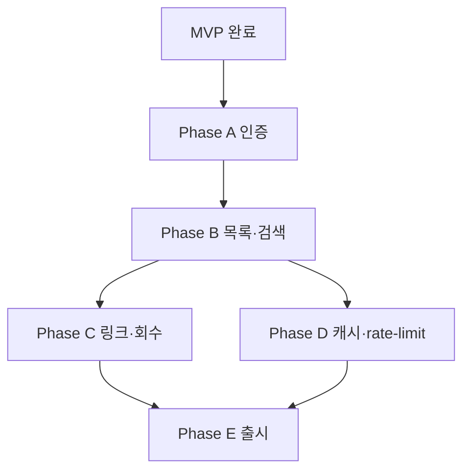

# ROADMAP — 관리자 도구 확장 (Post-MVP)

> 작성일: 2026-05-16
> 기준 MVP: `docs/PRD.md`, `docs/ROADMAP.v2.md`
> 참고 예제: https://github.com/gymcoding/invoice-web
> 대상 브랜치: `main` (또는 `feat/admin`)

---

## 1. 개요

### 한 줄 요약

MVP의 무인증 토큰 링크 모델은 그대로 두고, 발행자(1인 사업자/소규모 에이전시)가 견적서를 **검색·관리·공유**할 수 있는 비밀번호 보호 관리자 면을 추가한다.

### MVP와의 관계

MVP(`docs/PRD.md` §3)의 **In** 항목은 변경 없음. 본 로드맵은 PRD §3의 **Out** 항목 중 다음을 In으로 끌어온다:

| MVP에서 Out               | 본 로드맵에서 In                        | 비고               |
| ------------------------- | --------------------------------------- | ------------------ |
| 발행자 회원가입·로그인    | 비밀번호 단일 계정 로그인 + 세션        | 다중 사용자는 후속 |
| 견적서 작성·수정·삭제 UI  | (여전히 Out) Notion이 대체              | UI 추가 없음       |
| 견적서 검색·필터·대시보드 | **In** — 발행자 전용 목록/검색/필터     |                    |
| 이메일 자동 발송·알림     | (여전히 Out)                            |                    |
| 토큰 회수/만료            | **In** — 발행자가 토큰 회수/재발급 가능 |                    |

### 비목표 (여전히 Out)

- 수신자 회원가입
- 결제·이메일 자동 발송·서명/승인 워크플로
- 다국어, 첨부파일, 견적서 버전 히스토리·diff
- 다중 발행자 (조직/팀)

---

## 2. 성공 지표 / 수용 기준

### E2E 검증 (Playwright MCP 자동화)

- [ ] V8. 관리자 로그인 → `/admin`에서 견적서 목록 가시
- [ ] V9. 잘못된 비밀번호 → 401 화면 + 1초 이상 throttle
- [ ] V10. 미인증 상태로 `/admin/*` 접근 → `/admin-login`으로 리다이렉트
- [ ] V11. 검색창에 `client_name` 부분일치 입력 → 결과 즉시 필터
- [ ] V12. 상태/만료 필터 토글 → 목록 갱신
- [ ] V13. "링크 복사" 버튼 클릭 → `/invoice/<id>?token=<...>` 가 클립보드에 들어가고 토스트 노출
- [ ] V14. "토큰 회수" 클릭 → 즉시 새 토큰 생성, 기존 링크는 다음 조회부터 404
- [ ] V15. 분당 60회 초과 요청 → 429 응답 (rate limit)

### 자동 검증

- [ ] A5. `npm run lint`, `npm run build` 모두 통과
- [ ] A6. 빌드 산출물에 비밀번호 해시 미포함
- [ ] A7. `/admin/*`와 `/admin-login`은 `noindex`, 토큰 노출 없음
- [ ] A8. 세션 쿠키는 `HttpOnly`, `Secure`(prod), `SameSite=Lax`

---

## 3. 단계별 마일스톤

### Phase A — 인증 인프라 ✅ 완료 (2026-05-16)

**Type**: Library/internal + User-scenario
**의존성**: MVP 완료

**작업 항목**

| ID  | Task                                                                              | 상태 | 구현 노트                                                                                              |
| --- | --------------------------------------------------------------------------------- | ---- | ------------------------------------------------------------------------------------------------------ |
| A-1 | `lib/auth/password.ts` — scrypt 기반 해시·비교                                    | ✅   | bcrypt/argon2 대신 **Node 내장 `crypto.scrypt`** 채택 (네이티브 의존성 zero, OWASP 권장)               |
| A-2 | `lib/auth/session.ts` — JWT(HS256) sign/verify, 만료 24h                          | ✅   | **jose** 사용 (Web Crypto 기반 → Edge runtime OK), payload는 `sub: "admin"`만                          |
| A-3 | `ADMIN_PASSWORD_HASH`, `SESSION_SECRET`, `NEXT_PUBLIC_SITE_URL` 환경 변수         | ✅   | `.env.local.example` 갱신, 부팅 시 검증은 lazy(`getSecret()` 첫 호출 시점에 throw)                     |
| A-4 | `app/admin-login/page.tsx` — Server Component shell + `login-form.tsx` 클라이언트 | ✅   | Server Action `loginAction` + `useActionState`로 에러 표시, 이미 로그인된 사용자는 `/admin` 리다이렉트 |
| A-5 | `middleware.ts` — `/admin/*` 보호                                                 | ✅   | 미인증 접근 시 **307 redirect** (`NextResponse.redirect` 기본값)                                       |
| A-6 | 비밀번호 실패 시 1초 sleep                                                        | ✅   | `loginAction` 안에서 `await sleep(1000)` 후 에러 반환 — Phase D rate-limit이 들어오면 1차 방어로 격하  |
| A-7 | `scripts/hash-password.mjs` CLI 헬퍼                                              | ✅   | 표준 입력으로 비밀번호 받아 stdout으로 해시 출력 (stderr로 프롬프트만, 해시는 안전하게 stdout)         |
| A-8 | `app/admin/{page,layout}.tsx` placeholder + 로그아웃 폼                           | ✅   | Phase B 자리를 잡고, 로그아웃 Server Action(`logoutAction`)으로 쿠키 삭제                              |

**Done**

- 단위 테스트 (`tests/lib/auth/password.test.ts` 5건, `session.test.ts` 5건) 통과 — 총 vitest 20/20
- 라이브 HTTP 검증: `GET /admin` → `307 Location: /admin-login`, `GET /admin-login` → `200`
- Playwright MCP 스냅샷 `ui-admin-login.png` 저장 (실제 카드 UI 렌더)
- `npm run check-all` 통과 (lint + typecheck + format:check + test)

**구현 deviation (ROADMAP 원안 대비)**

- bcrypt/argon2 → **scrypt**: 네이티브 빌드 zero, Edge runtime은 어차피 middleware만 다루므로 password 함수는 Node에서만 호출됨
- 302 → **307**: `NextResponse.redirect`의 Next.js 기본값. 의미 동일(임시 redirect), 메서드 보존 측면에서 307이 더 명료
- 부팅 시 명확한 에러 → **lazy**: 환경 변수 누락은 첫 sign/verify 호출 시 throw. `verifySession(undefined)`는 즉시 false 반환하므로 미설정 상태에서도 redirect 흐름은 동작

**잔여 (Phase B 이후로 미룸)**

- 실제 로그인 성공 플로(쿠키 set → `/admin` 도달) E2E 검증 — `.env.local`에 실제 hash·secret 주입 후 수동 검증 권장
- V9의 "1초 이상 throttle" 자동화 — Phase D rate-limit 도입 시 단위 테스트로 가시화

**리스크 (남은 항목)**

- JWT secret 유출 → 빌드 산출물 grep 게이트는 Phase E에서 (`ntn_`, `SESSION_SECRET` 값 substring 모두)

---

### Phase B — 관리자 레이아웃 + 견적서 목록 (3~4일)

**Type**: User-scenario
**의존성**: Phase A

**작업 항목**

| ID  | Task                                                                                               | Acceptance                                     |
| --- | -------------------------------------------------------------------------------------------------- | ---------------------------------------------- |
| B-1 | `app/admin/layout.tsx` + `components/admin/admin-header.tsx`, `admin-nav.tsx`, `logout-button.tsx` | 모든 admin 페이지 헤더에 "로그아웃" 가시       |
| B-2 | `app/admin/page.tsx` — 대시보드(견적서 수, 만료 임박, 미열람 수 카드)                              | 3개 KPI 카드                                   |
| B-3 | `app/admin/invoices/page.tsx` — 견적서 목록 테이블 (페이지네이션)                                  | 페이지당 20개, 페이지 이동 동작                |
| B-4 | `components/admin/search-bar.tsx` — `client_name` 부분 일치 검색                                   | 입력 즉시 URL `?q=` 동기화                     |
| B-5 | `components/admin/filter-panel.tsx` — 상태(`draft`/`sent`/`viewed`) + 만료 여부 토글               | 다중 선택 가능, URL `?status=&expired=` 동기화 |
| B-6 | `components/admin/invoice-table.tsx` — 정렬(발행일/총액) 토글                                      | 컬럼 헤더 클릭 시 asc/desc                     |
| B-7 | `app/admin/invoices/loading.tsx` + skeleton                                                        | Suspense fallback                              |

**Done**

- V8, V11, V12 Playwright 시나리오 통과
- 모바일 360px에서 가로 스크롤 없음

**리스크**

- Notion API rate limit (3 req/s) → Phase D의 캐시·dedupe 필요

---

### Phase C — 링크 생성·공유·토큰 회수 (2~3일)

**Type**: User-scenario
**의존성**: Phase B

**작업 항목**

| ID  | Task                                                                                                                 | Acceptance                           |
| --- | -------------------------------------------------------------------------------------------------------------------- | ------------------------------------ |
| C-1 | `lib/utils/link-generator.ts` — `id + token → /invoice/<id>?token=<...>` URL 생성, base URL은 `NEXT_PUBLIC_SITE_URL` | 단위 테스트: 정상 / 환경 변수 미설정 |
| C-2 | `components/admin/copy-button.tsx` — `navigator.clipboard.writeText` + sonner 토스트                                 | 클릭 시 "복사됨" 토스트 1회          |
| C-3 | `components/admin/share-button.tsx` — 이메일 (mailto:) / 텔레그램 share URL                                          | 두 옵션을 dropdown으로               |
| C-4 | "토큰 회수" 액션 — Server Action으로 Notion `access_token` 필드 재발급                                               | 회수 후 기존 URL은 404               |
| C-5 | `app/api/admin/regenerate-token/route.ts` (또는 Server Action) — POST `{ invoiceId }` → 새 토큰 반환                 | 인증 필수, CSRF 방어                 |

**Done**

- V13, V14 Playwright 시나리오 통과
- 회수된 토큰이 다음 조회 요청에서 즉시 404

**리스크**

- 토큰 회수와 동시에 다른 탭이 보고 있다면 다음 새로고침에서 끊김 → 의도된 동작, UX 메시지로 안내

---

### Phase D — 캐시 + Rate Limit + 관찰성 (2일)

**Type**: Library/internal
**의존성**: Phase B (캐시 적용 대상이 있어야 의미가 있음)

**작업 항목**

| ID  | Task                                                                                 | Acceptance                                  |
| --- | ------------------------------------------------------------------------------------ | ------------------------------------------- |
| D-1 | `lib/cache.ts` — Notion 응답 60초 dedupe (`unstable_cache` 또는 LRU + ttl)           | 동일 id 1초 내 2회 호출 시 Notion API 1회만 |
| D-2 | `lib/rate-limit.ts` — IP+route 단위 token bucket (분당 60)                           | 초과 시 429 응답                            |
| D-3 | `middleware.ts` rate limit 적용 — `/invoice/*`, `/api/invoice/*/pdf`, `/admin-login` | V15 통과                                    |
| D-4 | `lib/logger.ts` 확장 — rate-limit hit 로깅                                           | `event: "ratelimit.deny"` 라인 출력         |
| D-5 | (선택) Vercel 또는 Upstash KV 어댑터 — 메모리 기반은 단일 인스턴스에서만 동작        | 환경 변수로 분기                            |

**Done**

- 단위 테스트 (`lib/cache.test.ts`, `lib/rate-limit.test.ts`) 통과
- V15 Playwright 시나리오 통과

**리스크 (높음)**

- Vercel serverless는 각 인스턴스 메모리가 독립 → 인스턴스 수가 많아지면 rate limit이 약해짐 → D-5로 KV 채택 권장
- 캐시가 토큰 회수 후 stale 응답을 줄 위험 → `revalidateTag` 또는 토큰 키 포함 캐시 키

---

### Phase E — 출시 점검 + 회귀 (1일)

**Type**: User-scenario
**의존성**: Phase A~D

**작업 항목**

| ID  | Task                                                               | Acceptance                  |
| --- | ------------------------------------------------------------------ | --------------------------- |
| E-1 | V8~V15 전수 회귀                                                   | 8/8 통과, 스크린샷 저장     |
| E-2 | MVP V1~V7 회귀 (관리자 기능 추가가 MVP를 깨지 않았는지)            | 7/7 통과                    |
| E-3 | `npm run build` 성공, Dynamic 표기 확인 (`/admin/*` 모두 Dynamic)  | 빌드 로그 grep              |
| E-4 | 빌드 산출물 grep — 비밀번호 해시·세션 시크릿·실 토큰 미포함        | 0 hit                       |
| E-5 | `vercel.json`에 `/admin/*` → `noindex` 헤더 추가, `/admin-login`도 | DevTools 헤더 확인          |
| E-6 | 프로덕션 배포 + 수동 검증 (관리자 1회 로그인, 링크 발급, 회수)     | Vercel preview 통과 후 prod |

**Done**

- V8~V15, V1~V7 모두 통과
- 프로덕션에서 1회 사용자 시나리오 종료

---

## 4. 의존성 그래프

**크리티컬 패스**: MVP → A → B → C → E (약 9~12 영업일)
**병렬화**: Phase D는 B 이후 C와 동시 진행 가능

---

## 5. 크로스커팅 워크스트림

### 5.1 보안

- 비밀번호: bcrypt cost 12 이상 또는 argon2id
- 세션: JWT HS256, `HttpOnly` `Secure`(prod) `SameSite=Lax`, 24h 만료
- 토큰 재발급: Server Action 또는 인증된 API. CSRF는 Next.js Server Action 기본 보호 활용
- 산출물 grep 게이트 확장: 토큰 + 비밀번호 해시 + 세션 시크릿

### 5.2 운영 환경 변수 (추가)

| 키                          | 용도                                                      |
| --------------------------- | --------------------------------------------------------- |
| `ADMIN_PASSWORD_HASH`       | bcrypt/argon2 해시 1개 (단일 관리자 계정)                 |
| `SESSION_SECRET`            | JWT 서명 키 (32B+)                                        |
| `NEXT_PUBLIC_SITE_URL`      | 링크 생성 시 base URL (예: `https://invoice.example.com`) |
| `RATELIMIT_KV_URL` (선택)   | Upstash KV REST URL                                       |
| `RATELIMIT_KV_TOKEN` (선택) | Upstash KV REST token                                     |

### 5.3 관찰성

- 모든 Server Action·라우트에서 `logger.info({ event, ... })` 호출
- 실패 이벤트: `auth.fail`, `ratelimit.deny`, `token.denied`, `token.regenerated`
- 시크릿/토큰 값은 절대 payload에 포함 금지 (PRD §7 정책 유지)

### 5.4 테스트 전략

- 트랙 1: vitest — `lib/auth/*`, `lib/cache`, `lib/rate-limit`, `lib/utils/link-generator`
- 트랙 2: Playwright MCP — V8~V15
- 회귀 풀: MVP V1~V7 + Phase A~D 누적

---

## 6. Open Questions

- [ ] 비밀번호 변경 UI (현 로드맵: 환경 변수 재설정 + 재배포로 갈음). 필요 시 별도 페이지 추가
- [ ] 다중 관리자 계정 (현 로드맵: 단일). 조직/팀 기능이 들어오면 별도 v3 로드맵
- [ ] 발행자가 Notion 외부에서 견적서 작성 UI를 원할 경우 — 본 로드맵 범위 밖
- [ ] 토큰 회수 이력(audit log) — Phase D logger로 부분 커버, 별도 page는 후속

---

## 7. PRD ↔ ROADMAP 추적 매트릭스

| 항목                                   | 단계       | 검증            |
| -------------------------------------- | ---------- | --------------- |
| PRD §10 토큰 회수/만료                 | Phase C    | V14             |
| PRD §10 (해당 사항 없음) 검색·대시보드 | Phase B    | V8, V11, V12    |
| PRD §7 보안 모델 확장 (세션)           | Phase A, E | V9, V10, A6, A8 |
| 예제 레포 v2 관리자 패턴               | Phase A~C  | V8~V14          |
| Notion API rate limit 보호             | Phase D    | (간접) V15      |
