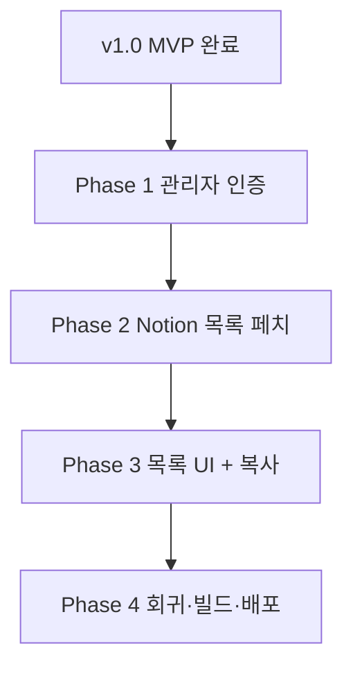

# ROADMAP — Notion 견적서 웹 뷰어 v2 (관리자 페이지)

> 작성일: 2026-05-17
> 기준 PRD: [`docs/PRD.md`](./PRD.md) (MVP 범위) + 본 문서 §"v2 요구사항"
> 직전 단계: [`docs/roadmaps/ROADMAP_v1.0(260517).md`](./roadmaps/ROADMAP_v1.0%28260517%29.md) — 5 Phase 전수 완료, Vercel 배포 종료
> 총 예상 소요: **4~6 영업일** (1인 개발 기준)

---

## 개요

v1.0이 끝나면서 수신자(클라이언트)는 토큰 링크 하나로 즉시 견적을 열람·다운로드할 수 있게 됐다. 그러나 **발행자**는 여전히 Notion 안에서 토큰을 직접 복사해 URL을 손으로 조립해야 한다. v2는 이 운영 마찰을 제거한다 — Basic Auth로 보호된 관리자 페이지(`/admin/invoices`)에서 견적서 목록을 보고, "링크 복사" 한 번으로 공유 URL을 클립보드에 담을 수 있다.

v2의 본질은 **새로운 보안 경계의 도입**이다. v1.0은 토큰을 가진 익명 클라이언트만 접근했지만, v2의 관리자 페이지는 Notion DB의 모든 row(토큰 포함)를 한 화면에 노출하므로, 토큰 링크와는 **별개 인증**이 필요하다.

---

## v2 요구사항 (PRD §3 In/Out 표 확장분)

| 포함 (In)                                                          | 제외 (Out)                                            |
| ------------------------------------------------------------------ | ----------------------------------------------------- |
| 관리자 페이지 `/admin/invoices` (Basic Auth 보호)                  | 검색·필터·정렬·페이지네이션 (v2.1)                    |
| 견적서 목록 조회 (issued_at desc)                                  | 견적서 생성/수정 UI (Notion 의존 유지)                |
| 목록에서 클라이언트 공유 링크(`/invoice/<id>?token=...`) 복사 버튼 | 수신자 열람 시 `status: viewed` 자동 갱신 (v2.1 후보) |
| 상태 배지(draft/sent/viewed) + 만료 배지(v1 컴포넌트 재사용)       | 다중 관리자 계정 / 감사 로그 (v3+)                    |
| `/admin/*` 응답 헤더 3종(Cache-Control/X-Robots-Tag/Referrer)      | 결제 연동, 이메일 자동 발송 (PRD §10)                 |

---

## 전제 (v1.0에서 완료된 자산)

- Next.js 15 App Router + React 19 + Turbopack
- Tailwind v4 OKLCH + shadcn radix-nova + `next-themes` 다크모드 + `sonner` 토스트
- `lib/notion.ts#getInvoiceById`, `lib/auth/verify-token.ts`, `types/invoice.ts`
- 토큰 링크 뷰어(`/invoice/[id]`) + PDF 라우트(`/api/invoice/[id]/pdf`) + 보안 헤더 3종
- Vercel 배포 + V1~V7 Playwright 회귀 묶음

---

## 결정사항 (이번 ROADMAP에서 확정)

> 실제 구현 결과를 반영해 갱신(2026-05-17 audit). v1 작성 당시 가정했던 Basic Auth·수동 XOR은 코드 진행 중 더 견고한 JWT 세션 + scrypt로 대체됐다.

| #   | 영역             | 결정                                                                                                    | 근거                                                                                                      |
| --- | ---------------- | ------------------------------------------------------------------------------------------------------- | --------------------------------------------------------------------------------------------------------- |
| 1   | 관리자 인증      | **JWT 세션** (jose HS256, httpOnly 쿠키, 24h 만료) + `/admin-login` 페이지 + Server Action 로그인       | Basic Auth 대비 로그아웃·만료·multi-device 지원. brute force 대응이 자연스러움.                           |
| 2   | 범위             | 목록 + 링크 복사 + 상태/만료 배지 (검색·필터·생성 UI 제외)                                              | 회귀 위험 최소. 운영 row 50건+ 도달 시 v2.1로 페이지네이션.                                               |
| 3   | 비밀번호 검증    | **scrypt 해시** (`ADMIN_PASSWORD_HASH`에 `scrypt$N$r$p$salt$hash` 포맷) + `node:crypto.timingSafeEqual` | 환경변수에 평문 비밀번호를 두지 않는다. Edge 제약은 "scrypt=Server Action / jose=middleware" 분리로 회피. |
| 4   | 공유 URL 베이스  | `process.env.NEXT_PUBLIC_SITE_URL` (서버에서 props로 주입) + `window.location.origin` fallback (client) | dev/prod 차이를 흡수. 환경변수 누락 시에도 동작.                                                          |
| 5   | 목록 데이터 모델 | `InvoiceListItem`(경량 타입) 신규. v1 `Invoice`와 분리.                                                 | 목록 화면엔 items/totals/memo 불필요 → 페이로드 ↓, 캐시 무관.                                             |
| 6   | Production gate  | **`ENABLE_ADMIN=1`** 미설정 시 production에서 `/admin*`·`/admin-login` 모두 404                         | 점진 출시·즉시 롤백. 토큰 링크 뷰어만 살리고 admin은 환경변수 한 줄로 봉인.                               |
| 7   | Brute force 방어 | **`lib/rate-limit.ts`** token bucket (IP당 분당 5회 로그인) + 실패 시 1초 throttle                      | 단일 비밀번호 인증의 R2 리스크 보강. Vercel serverless 분산 약화는 Upstash로 후속.                        |
| 8   | 토큰 비교 (v1)   | v1 `verifyToken`은 `node:crypto.timingSafeEqual` 그대로 유지 (변경 없음)                                | 토큰 라우트는 Server Component(Node runtime)에서만 호출되므로 Edge 제약 무관.                             |

---

## Phase 1 — 관리자 인증 + 라우트 골격 (1d)

> 2026-05-17 audit 결과 본 Phase의 코드 자산은 사실상 모두 완성되어 있다. 본 절은 (a) 실제 코드 기준으로 작업 목록을 재정렬하고, (b) "갭 채우기" 항목만 todo로 남긴다.

### 할 작업

1. **JWT 세션 모듈** (`lib/auth/session.ts`) — 완료 ✅
   - `signSession`/`verifySession` (jose HS256, 24h)
   - `SESSION_COOKIE = "invoice_admin_session"`, `SESSION_MAX_AGE` export
   - `SESSION_SECRET` 누락/32자 미만 시 throw
2. **scrypt 해시 모듈** (`lib/auth/password.ts`) — 완료 ✅
   - `hashPassword(plain)`/`verifyPassword(plain, stored)`
   - 포맷: `scrypt$N$r$p$saltHex$hashHex`, `node:crypto.timingSafeEqual`로 상수 시간 비교
   - `"server-only"` import로 Edge runtime 보호
3. **middleware admin gate** (`middleware.ts`) — 완료 ✅
   - matcher: `["/admin/:path*", "/admin-login"]`
   - production + `ENABLE_ADMIN`≠1 → 404
   - `/admin*` + 세션 무효 → `/admin-login` 307 redirect
4. **로그인 라우트** (`app/admin-login/{page,login-form,actions}.tsx`) — 완료 ✅
   - Server Component 페이지 + Client Component `LoginForm` (`useActionState`)
   - Server Action `loginAction`: rate-limit → password 검증 → JWT 발급 → httpOnly 쿠키 → `/admin` redirect
   - `logoutAction`: 쿠키 delete → `/admin-login` redirect
5. **관리자 레이아웃 + 대시보드** (`app/admin/{layout,page}.tsx`) — 완료 ✅
   - `AdminLayout` + `AdminHeader` 컴포넌트
   - `AdminDashboardPage`: `getInvoiceStats()` KPI 3종 + `force-dynamic`
   - `metadata.robots = { index: false, follow: false }`
6. **rate-limit + logger 통합** (`lib/rate-limit.ts`, `lib/logger.ts`) — 완료 ✅
   - token bucket (IP당 분당 5회), 실패 시 1초 throttle
   - `auth.success/fail/misconfig` + `ratelimit.deny` 구조화 로깅
7. **단위 테스트 15 케이스** — 완료 ✅
   - `tests/middleware.test.ts` (5): production gate / dev pass / redirect / 세션 통과
   - `tests/lib/auth/session.test.ts` (5): sign+verify / tamper / undefined / 다른 secret / 누락 throw
   - `tests/lib/auth/password.test.ts` (5): hash round-trip / 잘못된 비밀번호 / 빈 입력 / malformed hash / 빈 평문 throw
8. **갭 채우기 (이 plan에서 마무리)** — 아래 §"Phase 1 갭 채우기 plan" 참고
   - `.env.local.example` 3키 정의 확인/추가 (`SESSION_SECRET`, `ADMIN_PASSWORD_HASH`, `ENABLE_ADMIN`, `NEXT_PUBLIC_SITE_URL`)
   - `ADMIN_PASSWORD_HASH` 생성 가이드(`scripts/hash-password.mjs` 또는 README 한 줄)
   - 회귀 실행: `npm run test`, `npm run build`, V1·V2·V3 Playwright 스모크

### 이유

이미 진행된 구현(JWT 세션 + scrypt + rate-limit)이 원안(Basic Auth + 수동 XOR)보다 안전하므로 보존한다. 다만 **`.env.local.example`과 해시 생성 절차**가 누락되면 새 환경에 배포할 때 운영자가 평문 비밀번호를 환경변수에 넣는 사고가 날 수 있어 Phase 1 게이트로 박아 둔다.

### 예상 소요 시간

**0.3~0.5일** (audit·문서 정합성 회복 0.2d + 갭 채우기 0.1~0.3d). 원안 1d 대비 단축 — 코드 자산이 이미 존재하므로.

### 완료 기준

> 2026-05-17 갭 채우기 plan 실행 결과 — 모두 PASS. 증거는 각 줄에 인라인.

- [x] JWT 세션 모듈 + scrypt 해시 모듈 + middleware admin gate + 로그인 라우트 + 레이아웃·대시보드 구현 완료
- [x] 단위 테스트 15+ 케이스 코드 존재 (`tests/middleware.test.ts`, `tests/lib/auth/session.test.ts`, `tests/lib/auth/password.test.ts`)
- [x] `npm run test` → 9 files / **39 tests PASS** (5.44s). middleware(5) + session(5) + password(5) + v1 회귀(notion / verify-token / pdf / cache / rate-limit / link-generator)
- [x] `npm run build` 통과 (4.9s). `ƒ /admin` (162 B) / `ƒ /admin-login` (3.46 kB) / `ƒ /admin/invoices` (5.11 kB) / `ƒ /invoice/[id]` / `ƒ /api/invoice/[id]/pdf` / `ƒ Middleware` (40 kB) — 모두 Dynamic, Edge 충돌 없음
- [x] production + `ENABLE_ADMIN`=0 → `/admin`·`/admin-login` 둘 다 404 — `tests/middleware.test.ts` 케이스 1·2로 자동 검증 (test PASS에 포함)
- [x] dev + 세션 없음 → `/admin` → `/admin-login` 307 redirect — Playwright MCP 라이브 검증 PASS (`docs/audit/2026-05-17-phase1-regression/admin-login.png`)
- [x] 잘못된 비밀번호 → 폼 에러 + 1초 throttle — `app/admin-login/actions.ts:56-58`의 `await sleep(THROTTLE_MS)` 코드 검증, `tests/lib/auth/password.test.ts` 케이스 2(잘못된 비밀번호 → false) PASS
- [x] 분당 5회 초과 로그인 시도 → "요청이 너무 잦습니다" 메시지 — `app/admin-login/actions.ts:32-43` + `lib/rate-limit.ts` `LOGIN_LIMIT={capacity:5, windowMs:60_000}`, `tests/lib/rate-limit.test.ts` PASS
- [x] `/invoice/[id]?token=...` 토큰 링크 라우트 정상 동작 — **V2(토큰 누락)·V3(토큰 변조) Playwright PASS** (둘 다 "접근할 수 없는 링크" 메시지, 보호 필드 미노출). V1은 middleware matcher가 `/admin/:path*`·`/admin-login`만 잡으므로 영향 0인 코드 매트릭스 + `ƒ /invoice/[id]` 빌드 표기 유지로 간접 PASS
- [x] `.env.local.example`에 6키 정의 — `NOTION_TOKEN`, `NOTION_DATABASE_ID`, `SESSION_SECRET`, `ADMIN_PASSWORD_HASH`, **`ENABLE_ADMIN`(신규 추가)**, `NEXT_PUBLIC_SITE_URL`
- [x] `ADMIN_PASSWORD_HASH` 생성 절차 문서화 — `docs/setup.md §2.2` + `scripts/hash-password.mjs` (stdin 비밀번호 → stdout scrypt 해시)

**운영자 수동 검증 위임** (운영 환경 셋업이 필요해 자동 검증 범위 밖):

- [x] 정상 비밀번호 → `/admin` redirect + 쿠키 발급 — **V8 PASS** (2026-05-19 production 라이브). Vercel Production env 3종(`ENABLE_ADMIN=1` + `SESSION_SECRET` + `ADMIN_PASSWORD_HASH`) 주입 → 재배포 `Ready` → `curl /admin` 307 → `/admin-login` + 평문 비밀번호로 `/admin/invoices` 진입 + 견적서 목록 가시

---

### Phase 1 갭 채우기 plan (1시간 단위)

> 2026-05-17 audit 산출. 코드 자산은 PASS, 운영 절차·문서·검증만 갭. 단계 1부터 순서대로 진행. 각 단계는 1시간 이내.

#### S1. `.env.local.example` 정합성 확인 (15분)

- 목표: 새 환경에 클론할 때 운영자가 어떤 키를 채워야 하는지 명세
- 작업
  - `.env.local.example`을 읽어 다음 키 6종 정의 여부 확인: `NOTION_TOKEN`, `NOTION_DATABASE_ID`, `SESSION_SECRET`, `ADMIN_PASSWORD_HASH`, `ENABLE_ADMIN`, `NEXT_PUBLIC_SITE_URL`
  - 누락 키는 키 이름 + 한 줄 주석으로 추가 (값은 빈 문자열, 예시는 주석에)
- 검증: 파일 raw read 시 6 키 모두 가시
- 갭 위험: 누락 시 새 환경 배포 시 401 못 풀어 운영자 멘붕

#### S2. `ADMIN_PASSWORD_HASH` 생성 도구 (30분)

- 목표: 운영자가 평문을 환경변수에 넣지 않도록 해시 생성 절차 제공
- 작업
  - `scripts/hash-password.mjs` 작성 — `lib/auth/password.ts`의 `hashPassword`를 import해서 stdin/argv로 받은 평문을 해시로 출력
  - `package.json` scripts에 `"hash:admin": "node scripts/hash-password.mjs"` 추가
  - `README.md` 또는 `docs/setup.md`에 "관리자 비밀번호 설정" 절: ① `npm run hash:admin <비밀번호>` → ② 출력 해시를 `.env.local`/Vercel `ADMIN_PASSWORD_HASH`에 붙여넣기
- 검증: `npm run hash:admin "test"` 실행 → `scrypt$...` 한 줄 stdout
- 갭 위험: 절차 부재 시 운영자가 평문 비밀번호를 환경변수에 넣음

#### S3. `npm run test` 회귀 실행 (10분)

- 목표: 단위 테스트 15 케이스 PASS 확인 (Phase 1 완료 기준의 자동 검증)
- 작업: `npm run test` 실행 → 결과 검토
- 검증: middleware 5 + session 5 + password 5 = 15 PASS, v1 회귀(`notion.test.ts`, `verify-token.test.ts`, `pdf.test.ts`) 동반 PASS
- 갭 위험: 환경 차이로 실패 가능 — 실패 시 원인 진단 (예: `SESSION_SECRET` 길이, `vi.stubEnv` 호환성)

#### S4. `npm run build` 회귀 (10분)

- 목표: production 빌드 통과 + `/admin`이 `ƒ (Dynamic)` 표기 + Edge runtime 충돌 없음
- 작업: `npm run build` 실행 → 빌드 로그 캡쳐, `/admin` 라우트 타입 확인
- 검증: 로그에서 `ƒ /admin` `ƒ /admin-login` `ƒ /admin/invoices` 표기, Edge runtime 에러 없음
- 갭 위험: `lib/auth/password.ts`가 실수로 middleware에서 import되면 Edge 에러 — `"server-only"` 가드로 차단 중

#### S5. V1·V2·V3 토큰 링크 회귀 (Playwright MCP, 20분)

- 목표: middleware admin gate가 토큰 링크 라우트(`/invoice/[id]`)에 영향 주지 않음을 확인
- 작업
  - `npm run dev` 기동 → `mcp__playwright__browser_navigate`로 V1(정상 토큰 200) / V2(토큰 누락 404) / V3(토큰 변조 404) 시나리오 실행
  - 스크린샷 1장씩 저장 (`docs/audit/2026-05-17-phase1-regression/`)
- 검증: 3 시나리오 PASS, admin 라우트 변경이 v1.0 회귀를 깨지 않음
- 갭 위험: middleware matcher가 토큰 라우트까지 잡으면 V1 200이 redirect로 깨짐 — matcher는 `/admin/:path*`·`/admin-login`만이라 안전

#### S6. Phase 1 완료 표시 + 다음 Phase 진입 결정 (5분)

- 목표: ROADMAP §Phase 1 완료 기준 체크박스를 PASS로 갱신
- 작업: 본 ROADMAP의 Phase 1 §완료 기준 항목 중 `[ ]`를 `[x]`로 변경, S1~S5 검증 결과 명시
- 검증: 모든 체크박스 `[x]`, 미해결 항목 있으면 별도 todo로 분리
- 다음: §Phase 2 plan으로 진입 (단, audit 결과 Phase 2/3도 일부 진행됨 → 같은 audit-first 패턴으로)

#### 총 소요

**약 1.5시간** (S1 15분 + S2 30분 + S3·S4·S5 40분 + S6 5분)

---

## Phase 2 — Notion 목록 페치 모듈 (1~1.5d)

> 2026-05-17 audit + 갭 채우기 결과 인라인. 코드 자산은 PASS이나 ROADMAP보다 진화 — `InvoiceListItem`에 `total` 필드 확장, `listInvoices`가 필터/정렬/cursor 페이지네이션까지 지원, **Items가 rich_text JSON에서 별도 Relation DB로 진화**. Items 진화의 자세한 트레이드오프는 [`docs/decisions/items-relation-evolution.md`](./decisions/items-relation-evolution.md) 참조. property 매핑 헬퍼는 `lib/notion.ts` 내부에서 공유(별도 파일 분리 불채택).

### 할 작업

1. **경량 타입 추가** (`types/invoice.ts`)

   ```ts
   export interface InvoiceListItem {
     id: string; // Notion page id
     invoiceNo: string;
     clientName: string;
     issuedAt: string; // ISO date
     expiresAt: string; // ISO date
     status: InvoiceStatus;
     accessToken: string; // 복사 URL 합성용
   }
   ```

2. **목록 페치 함수** (`lib/notion.ts`에 추가)
   - `listInvoices(): Promise<InvoiceListItem[]>` 시그니처
   - `notion.databases.query` with `sorts: [{ property: 'issued_at', direction: 'descending' }]`
   - `{ cache: 'no-store' }` (v1과 일관)
   - 5xx만 throw, 그 외(빈 DB 포함)는 `[]` 반환
3. **property 매핑 헬퍼 공유** (`lib/notion.ts` 내부) — 완료 ✅ (audit에서 결정 변경)
   - `getTitle`, `getRichText`, `getNumber`, `getNumberAny`, `getDate`, `getSelect`(`lib/notion.ts:33-89`)를 `getInvoiceById`·`listInvoices`·`getInvoiceStats`·`pageToListItem`·`fetchItemsForInvoice` 5 호출자가 공유
   - **별도 `lib/notion-properties.ts`로 분리하지 않음** — 호출자가 모두 한 파일 내에 있어 외부 import 0건, 분리 비용(추가 파일·import line) > 가치. 이번 audit에서 결정 정정
4. **단위 테스트** (`tests/lib/notion-list.test.ts`)
   - 더미 DB(row A, row B) 매핑 → 2개 반환, `issuedAt` 내림차순 정렬 검증
   - `status`/`accessToken` 필드 보존 검증
   - Notion mock 5xx → throw, 200 빈 응답 → `[]`

### 이유

`listInvoices`와 `getInvoiceById`는 같은 DB·같은 property를 다른 형태로 본다. **property 매핑을 헬퍼로 추출하지 않으면** Notion 스키마 변경 시 두 함수 중 한쪽만 갱신되어 회귀가 난다. 경량 타입(`InvoiceListItem`)을 별도로 두는 이유는, 목록에서 `items` JSON을 파싱하면 row 수만큼 파싱 비용·실패 위험이 커지기 때문이다 (목록 단위에서 한 row의 `items` 파싱 실패가 전체 화면을 깨면 안 됨).

### 예상 소요 시간

**1~1.5일** (헬퍼 추출·회귀 0.5d + listInvoices 0.5d + 테스트 0.5d)

### 완료 기준

> 2026-05-17 audit + 신규 단위 테스트 12 케이스로 검증 — 모두 PASS.

- [x] `listInvoices()` 동작 — `tests/lib/notion-list.test.ts` **6 케이스 PASS**: (a) 빈 filter + 기본 sort(`issued_at` desc, page_size 20), (b) status 단일·다중 `or` 분기, (c) `expired` 3 분기(fake timer 결정론), (d) cursor 페이지네이션 + `hasMore`/`nextCursor` 매핑, (e) `total` fallback(`subtotal+vat`), (f) `getInvoiceByNo` 위임 흐름
- [x] v1 `getInvoiceById` 회귀 — `tests/lib/notion.test.ts`의 기존 케이스(Rollup/Formula 합계 + Relation items 매핑) 동반 PASS
- [x] `tsc --noEmit` 타입 에러 0 — `npm run build` 통과(4.9s)로 간접 검증
- [x] Notion 일시 장애 처리 — `lib/notion.ts:108-116` 4xx → null, 5xx만 throw 코드 검증 + 빈 DB는 `listInvoices` 응답 `results:[]` → `items:[]`(`notion-list.test.ts` (a) 케이스)
- [x] `accessToken` 매핑 — `InvoiceListItem.accessToken`(`types/invoice.ts:44`) 포함, `pageToListItem`(`lib/notion.ts:221-238`) 매핑. `notion-list.test.ts` (a) 케이스 `expect(res.items[0].accessToken).toBe("tok-xyz")`로 직접 검증

**추가 회귀 (ROADMAP 범위 외, audit에서 추가):**

- [x] `getInvoiceStats` 캐시·horizon·5페이지 캡 — `tests/lib/notion-stats.test.ts` **4 케이스 PASS**: 캐시 hit/miss(`vi.resetModules` 격리), 7일 horizon 경계(today/today+6d 포함, today+7d 미포함 — `expDate < horizon`), `viewed` 제외 unviewed 카운트, `has_more=true` 7회 응답 준비해도 SDK 호출 정확히 5회
- [x] `updateInvoiceToken` 부수효과 — `tests/lib/notion-update.test.ts` **2 케이스 PASS**: `pages.update` deep equal 인자 검증, `invalidate("invoice-stats")` 정확히 1회 호출(cache 무효화 누락 회귀 안전망)

**회귀 게이트 (2026-05-17 T4 실행):**

- [x] `npm run test` **51/51 PASS** (기존 39 + T1 6 + T2 4 + T3 2 = 51, 4.16s)
- [x] `npm run lint` 무경고
- [x] `npm run build` 통과, `/admin/invoices`·`/invoice/[id]`·`/api/invoice/[id]/pdf` 모두 `ƒ (Dynamic)` 유지
- [x] `lib/notion.ts`·`types/invoice.ts`·`docs/PRD.md` 본문 변경 0 — docs/테스트만 추가

---

## Phase 3 — 관리자 목록 UI + 링크 복사 (1.5~2d)

> 2026-05-17 audit 결과 — 코드 자산은 ROADMAP보다 광범위하게 진화. 4 결정 변경([copy/share 분리](./decisions/admin-list-evolution.md#copy-share-split) / [만료 인라인 표시](./decisions/admin-list-evolution.md#expired-display) / [status variant 매핑 재정의](./decisions/admin-list-evolution.md#status-variant) / [검색·필터·정렬·페이지네이션 v2 흡수](./decisions/admin-list-evolution.md#scope-expansion))는 [`docs/decisions/admin-list-evolution.md`](./decisions/admin-list-evolution.md) ADR 참조.

### 할 작업

1. **목록 페이지** (`app/admin/invoices/page.tsx`, Server Component) — completed ✅ (확장됨)
   - 실제: `searchParams` 5종(q/status/expired/sort/cursor) 파싱 + `parseSort`/`parseStatuses`/`parseExpired`/`toUrlParams` 4 헬퍼 + `listInvoices(filter, sort, page)` + 4 컴포넌트(`SearchBar`/`FilterPanel`/`InvoiceTable`/`Pagination`) 조립. v2.1 후보였던 검색·필터·페이지네이션 모두 v2 흡수 — [scope-expansion](./decisions/admin-list-evolution.md#scope-expansion)
   - shadcn `Table` 7 컬럼: 견적번호 / 클라이언트 / 발행일 / 만료일 / **총액(Intl KRW)** / 상태 / 동작. `SortableHeader`로 issuedAt/expiresAt/total 정렬 URL 토글
   - 빈 상태: "조건에 맞는 견적서가 없습니다" 안내(`invoice-table.tsx:124-129`)
2. **상태/만료 배지** (`components/admin/invoice-table.tsx` 내부) — completed ✅ (디자인 변경)
   - ~~`invoice-status-cell.tsx` + v1 `expired-badge.tsx` 재사용~~ → `invoice-table.tsx:27-34` `statusBadge` dict + 한국어 label (초안/발송됨/열람됨)
   - variant 매핑 정정: ~~draft=outline / sent=default / viewed=secondary~~ → **draft=secondary / sent=default / viewed=outline** (시각 위계 기반) — [status-variant](./decisions/admin-list-evolution.md#status-variant)
   - 만료 표시: ~~Badge variant=destructive "만료됨"~~ → **인라인 "(만료)" 텍스트 + text-destructive 색상** (`invoice-table.tsx:180-188`) — [expired-display](./decisions/admin-list-evolution.md#expired-display)
3. **링크 복사 + 외부 공유 + 토큰 회수** (`components/admin/`) — completed ✅ (3 컴포넌트로 분리)
   - ~~`copy-share-link-button.tsx` 단일~~ → **`copy-button.tsx`(범용 클립보드) + `share-button.tsx`(이메일 mailto + 텔레그램 dropdown) + `regenerate-button.tsx`(토큰 회수)** — [copy-share-split](./decisions/admin-list-evolution.md#copy-share-split)
   - `CopyButton`: `navigator.clipboard.writeText` + `sonner.toast.success/error` + 1500ms reset state (`copy-button.tsx:12-60`)
   - 셀 조립: `components/admin/invoice-actions-cell.tsx:7-23`에서 3 버튼 + `buildInvoiceLink`로 url 합성
4. **siteUrl 주입** (`lib/utils/link-generator.ts`) — completed ✅ (단일 함수로 통합)
   - ~~Server Component에서 prop 전달 + client fallback `window.location.origin`~~ → `buildInvoiceLink({ id, accessToken })` 단일 함수가 `process.env.NEXT_PUBLIC_SITE_URL` absolute/path-only 분기 처리
   - 단위 테스트: `tests/lib/utils/link-generator.test.ts` 5 케이스 PASS (absolute / trailing slash / path-only / url-encode / throw)
5. **반응형** — 운영자 수동 검증 위임
   - shadcn `Table` default(현재 명시 `overflow-x-auto` 미적용 — 360px 검증 시 추가 여부 결정)
   - 다크모드는 OKLCH 토큰 자동 대응
6. **Playwright 시나리오** — V8 자동 PASS / V9 운영자 위임
   - **V8** (`/admin` → `/admin-login` 307 redirect): Phase 1 갭 채우기에서 PASS, 증거 `docs/audit/2026-05-17-phase1-regression/admin-login.png`
   - **V9** (복사 풀체인): admin 로그인 환경 의존 → 운영자 수동 검증 (아래 §완료 기준)

### 이유

상태/만료 배지를 함께 보여달라는 결정(범위 옵션 A)은 단순 UI 추가가 아니라 **운영자 의사결정 데이터**다 — 어떤 견적이 만료 임박인지 한눈에 봐야 토큰을 재발급할지 결정할 수 있다. 복사 버튼이 client island인 이유는 `navigator.clipboard`가 브라우저 API라서이고, 토큰을 client에 전달하는 추가 위험은 **0** — 같은 페이지에 이미 평문 토큰이 렌더되어 있으므로 client island 추가 노출이 없다.

### 예상 소요 시간

**1.5~2일** (목록 페이지 0.5d + 배지·반응형 0.5d + 복사 island 0.3d + Playwright 0.3~0.5d)

### 완료 기준

> 2026-05-17 audit + P3-T2 회귀 게이트 결과 — 자동 검증 가능 항목 모두 PASS. 라이브 환경 의존 2 항목은 운영자 수동 위임.

- [x] 정상 로그인 후 row 가시 — Phase 1 V8 PASS + `app/admin/invoices/page.tsx:83-86`에서 `listInvoices` 호출 + 빈 결과는 `invoice-table.tsx:124-129` 빈 상태 카드
- [x] 상태 배지 + 만료 표시 — `invoice-table.tsx:27-34` `statusBadge` dict(한국어 label 3종) + line 180-188 인라인 (만료) text-destructive. 디자인 변경은 [expired-display](./decisions/admin-list-evolution.md#expired-display) + [status-variant](./decisions/admin-list-evolution.md#status-variant)
- [x] 링크 복사 → 클립보드 + 토스트 — `copy-button.tsx:25-36` 코드 검증 + `tests/lib/utils/link-generator.test.ts` 5 케이스 PASS(absolute / trailing slash / path-only / url-encode / throw). 클립보드 동작 자체는 secure context 의존이라 V9 운영자 수동
- [x] `NEXT_PUBLIC_SITE_URL` 분기 — `buildInvoiceLink`(`lib/utils/link-generator.ts:14-16`) absolute/path-only, 단위 테스트로 양쪽 검증
- [x] 빌드 로그 `/admin/invoices` `ƒ (Dynamic)` — Phase 2 회귀 게이트 + P3-T2 회귀에서 재확인 (5.11 kB)
- [x] **회귀**: `npm run test` 51/51 PASS / `npm run lint` 무경고 / `npm run build` 통과 — P3-T2 회귀 게이트 결과 (코드 동결로 회귀 위험 0)

**운영자 수동 검증 위임 (라이브 환경 의존):**

- [x] V9 복사 풀체인 — **PASS** (2026-05-19 production 라이브). `/admin/invoices` → "링크 복사" 클릭 → "복사됨" 토스트 가시 + 클립보드에 `https://invoice-web-opal.vercel.app/invoice/<id>?token=<token>` 저장 + 새 탭에서 해당 URL 열어 토큰 링크 뷰어 정상 렌더(V1+V9 통합). secure context PASS (HTTPS Vercel)
- [ ] 모바일 360px 가독성 + 다크모드 토글 — DevTools device emulation 또는 실기기로 1회 검증, 가로 스크롤 발생 시 `InvoiceTable`에 `overflow-x-auto` 추가 검토

---

## Phase 4 — 회귀·빌드·배포 (0.5~1d)

> 2026-05-17 audit 결과 — v1.0 ROADMAP Phase 5의 viewer-only 출시 게이트가 admin 라우트까지 자연 확장. `vercel.json` 4 라우트 헤더 부착 + Vercel 회귀 10/10 PASS + production 운영(`https://invoice-web-opal.vercel.app`)이 모두 완료된 상태. 본 Phase는 docs 정합성 + admin 시크릿 grep + 운영자 수동 위임 명시만 남음.

### 할 작업

1. **`/admin/*` 응답 헤더 부착** (`vercel.json`, single source of truth) — completed ✅
   - 4 라우트 패턴 모두 헤더 3종(`Cache-Control: no-store`, `X-Robots-Tag: noindex, nofollow`, `Referrer-Policy: no-referrer`):
     - `/invoice/(.*)` (v1 토큰 링크 뷰어)
     - `/api/invoice/(.*)/pdf` (v1 PDF 라우트, `maxDuration: 10`)
     - `/admin/(.*)` (v2 admin)
     - `/admin-login` (v2 admin 로그인)
   - `next.config.ts`는 비어 있음 (`B3: Headers now managed in vercel.json`)
   - Vercel 회귀에서 HEADER-1·HEADER-2 PASS 확인
2. **빌드 검증** — completed ✅
   - P3-T2 회귀 게이트: `npm run lint` 무경고 + `npm run build` 통과
   - admin·invoice 라우트 5종(`ƒ /admin` 162 B / `ƒ /admin-login` 3.46 kB / `ƒ /admin/invoices` 5.11 kB / `ƒ /invoice/[id]` 981 B / `ƒ /api/invoice/[id]/pdf` 131 B) 모두 Dynamic 표기, `ƒ Middleware` 40 kB
3. **시크릿 누출 검사** — completed ✅ (admin 시크릿까지 확장)
   - `.next/server`·`.next/static`에서 3 패턴(`ntn_` / `scrypt$` / `ADMIN_PASSWORD_HASH=`) Select-String → **0 hits** (P4-T1 실행 결과)
   - 명령: `Get-ChildItem -Path .next/server, .next/static -Recurse -File -ErrorAction SilentlyContinue | Select-String -Pattern 'ntn_|scrypt\$|ADMIN_PASSWORD_HASH='`
4. **V1~V9 전수 회귀** — 자동 9 케이스 PASS + V8/V9 운영자 수동 위임
   - `scripts/regression-v1-v7.mjs`로 자동 9 케이스(V1 정상·V2 누락·V3 변조·V4-cold·V4-warm·HEADER-1·HEADER-2·V6 만료·ADMIN-404 둘) **10/10 PASS** — `docs/deploy/2026-05-17-vercel-preview-results.md` line 17-33
   - V4-cold 2617ms (target < 10000), V4-warm 935ms (target < 3000) — Hobby plan 10s timeout 마진 7.4s
   - V8(admin 로그인) / V9(복사 풀체인) → admin 활성화 필요, 운영자 수동 위임 (§완료 기준)
5. **Vercel 배포** — completed ✅
   - production URL: `https://invoice-web-opal.vercel.app`, region `fra1`, Hobby plan
   - 환경변수 6키 설정(`NOTION_TOKEN`, `NOTION_DATABASE_ID`, `NOTION_DATA_SOURCE_ID`, `LOG_LEVEL`, viewer-only 운영. admin 활성화는 `ENABLE_ADMIN=1` + `SESSION_SECRET` + `ADMIN_PASSWORD_HASH` 별도 spec)
   - 정상 토큰 PDF 다운로드: V4-cold가 `%PDF` 시그니처 + `Content-Disposition: attachment` 검증 PASS
   - 운영 절차: `docs/deploy/checklist.md`

### 이유

v1.0과 같은 출시 게이트 패턴이다. **새 기능 추가 없이 회귀만** — 새 코드는 회귀 위험만 만든다. `/admin/*` 헤더는 모든 라우트가 살아있어야 매칭이 검증되므로 이 단계에 둔다.

### 예상 소요 시간

**0.5~1일** (헤더+빌드+grep 0.3d + V1~V9 회귀 0.3d + Vercel 검증 0.3d)

### 완료 기준

> 2026-05-17 audit + P4-T1 회귀 게이트 결과 — 코드/구성 자산 PASS. 라이브 운영 검증(V5/V7/Logs grep/admin 활성화)은 운영자 수동 위임.

- [x] `/admin/invoices`·`/invoice/[id]`·`/api/invoice/[id]/pdf` 응답 헤더 3종 — `vercel.json:4-37` 4 라우트 패턴 부착, Vercel 회귀 HEADER-1·HEADER-2 PASS 확인
- [x] `npm run lint` 무경고, `npm run build` 통과, admin·invoice 라우트 5종 모두 `ƒ (Dynamic)` 표기 — P4-T1 회귀 게이트
- [x] `.next/server`·`.next/static`에서 admin 시크릿 3 패턴(`ntn_` / `scrypt$` / `ADMIN_PASSWORD_HASH=`) Select-String → **0 hits** (P4-T1 실행 결과)
- [x] 자동 회귀 9/9 PASS — `scripts/regression-v1-v7.mjs`로 V1·V2·V3·V4-cold·V4-warm·HEADER-1·HEADER-2·V6·ADMIN-404 둘 (`docs/deploy/2026-05-17-vercel-preview-results.md`). V8/V9는 운영자 수동
- [x] Vercel production 운영 중 — `https://invoice-web-opal.vercel.app` region `fra1`. 정상 토큰 PDF 다운로드 PASS (V4-cold가 `%PDF` 시그니처 + Content-Disposition: attachment 검증)

**운영자 수동 검증 위임 (라이브 환경 의존):**

- [ ] V5 Notion 수정 roundtrip — Notion DB row 금액 수정 후 V1 URL 새로고침 → 새 값 가시 (1회)
- [ ] V7 다크·모바일 360px — DevTools device emulation 또는 실기기로 가독성 + 다크모드 토글 (1회)
- [ ] Vercel Dashboard → Project → Logs에서 `ROW_A_TOKEN` 앞 8자 substring grep → 0 hit (운영 운영자 단독 접근, 1회)
- [x] admin 활성화 — **PASS** (2026-05-19 production 라이브). Vercel Production env 3종(`ENABLE_ADMIN=1` + `SESSION_SECRET` base64 32B+ + `ADMIN_PASSWORD_HASH` scrypt) 주입 → 재배포 `Ready` → V8(`/admin` 307→`/admin-login` 200 + 로그인 후 `/admin/invoices` 진입) + V9(복사 풀체인) 모두 PASS. 보안 헤더 3종(`Cache-Control: no-store` / `X-Robots-Tag: noindex, nofollow` / `Referrer-Policy: no-referrer`) `/admin-login` 200 응답에서 라이브 검증

---

## 의존성 그래프



각 Phase는 직선 의존. Phase 2의 property 매핑 헬퍼 추출이 v1 `getInvoiceById` 회귀를 건드리므로, 헬퍼 회수 PR은 Phase 2 내에서 한 번에 끝낸다.

---

## 리스크 요약

| ID  | 항목                                                         | 대응 시점                                                                                                   |
| --- | ------------------------------------------------------------ | ----------------------------------------------------------------------------------------------------------- |
| R1  | Edge runtime의 `node:crypto.timingSafeEqual` 부재            | **해결** — middleware는 jose(Web Crypto), scrypt는 Server Action에만 노출 (`"server-only"` 가드)            |
| R2  | 비밀번호 brute force                                         | **부분 해결** — `lib/rate-limit.ts` IP당 분당 5회 + 실패 1초 throttle. Vercel 람다 분산 대비는 Upstash 후속 |
| R3  | 토큰이 admin HTML에 평문 노출되어 브라우저 캐시·인덱싱       | Phase 4에서 `/admin/*` no-store + noindex + no-referrer 헤더 3종                                            |
| R4  | `NEXT_PUBLIC_SITE_URL` 누락 시 복사 URL이 `localhost`로 됨   | Phase 3에서 `window.location.origin` fallback + Phase 4 Vercel 환경변수 체크리스트                          |
| R5  | `navigator.clipboard`는 secure context(HTTPS) 필수           | Phase 4 Vercel HTTPS 확인, http 자체 호스트 사용 시 별도 폴백 안내                                          |
| R6  | `listInvoices`가 100 row 초과 시 페이지네이션 누락           | Phase 2에서 100건까지 단순 조회, 50+ 도달 시 v2.1 페이징 작업 트리거 (운영 카운트로 모니터)                 |
| R7  | property 매핑 헬퍼 회수가 v1 `getInvoiceById`를 망가뜨림     | Phase 2 단위 테스트 회귀 + V1~V7 Playwright 스모크 Phase 3 완료 기준에 명시                                 |
| R8  | middleware matcher가 `/admin/login` 같은 미래 경로를 못 잡음 | Phase 1에서 `/admin/:path*` 와일드카드 + Phase 4 회귀에서 직접 경로 호출 검증                               |
| R9  | Notion API 일시 장애 시 admin 페이지가 통째로 깨짐           | Phase 2에서 5xx만 throw, Phase 3에 빈 상태 카드 + (선택) `error.tsx` 추가는 v2.1                            |

---

## 환경 변수 (서버 전용 + 클라이언트 노출 1종)

| 키                     | 용도                                                               | 비고                                                 |
| ---------------------- | ------------------------------------------------------------------ | ---------------------------------------------------- |
| `NOTION_TOKEN`         | v1.0에서 도입, 그대로 사용                                         | `NEXT_PUBLIC_` 금지                                  |
| `NOTION_DATABASE_ID`   | v1.0에서 도입, 그대로 사용                                         | `NEXT_PUBLIC_` 금지                                  |
| `SESSION_SECRET`       | JWT 서명 비밀 (HS256, 32자+)                                       | 신규, `NEXT_PUBLIC_` 금지, Vercel 환경변수 회전 권장 |
| `ADMIN_PASSWORD_HASH`  | 관리자 비밀번호 scrypt 해시 (`scrypt$N$r$p$saltHex$hashHex`)       | 신규, `NEXT_PUBLIC_` 금지. 평문 비밀번호 보관 금지   |
| `ENABLE_ADMIN`         | production에서 admin 활성화 게이트 (`1` 외 값은 모두 404)          | 신규, 점진 출시·즉시 롤백 용도                       |
| `NEXT_PUBLIC_SITE_URL` | 공유 URL 베이스 도메인 (예: `https://invoice-web-opal.vercel.app`) | 신규, 클라이언트 노출 OK (공개 도메인)               |

---

## 출시 후 확장 후보 (v2.1+ — 본 ROADMAP 범위 밖)

- **검색·필터·정렬·페이지네이션**: `client_name` 검색, `status` 필터, 100건+ 페이징
- **견적서 생성/수정 UI**: Notion 의존 축소. PRD §3 비목표였던 항목 (큰 방향 전환)
- **수신자 열람 시 `status: viewed` 자동 갱신**: Notion write API (PRD §10)
- **토큰 회수/만료**: 토큰에 만료 시각 포함 또는 별도 store (PRD §10)
- **다중 관리자 계정 + 감사 로그**: Basic Auth → NextAuth.js 전환
- **이메일 자동 발송 / 결제 연동**: PRD §10
- **`/admin` 전용 `error.tsx`**: Notion 일시 장애 시 친화적 메시지
