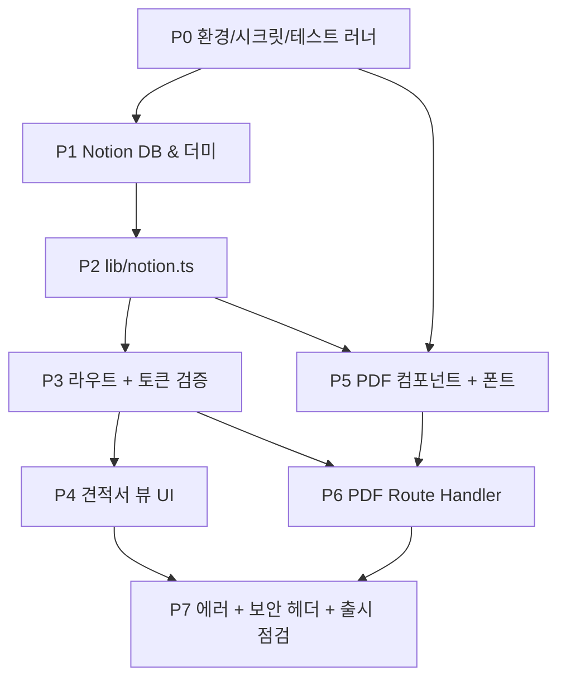

# ROADMAP v2 — Notion 견적서 웹 뷰어 MVP (테스트 강화판)

> 작성일: 2026-05-13
> 기준 PRD: `docs/PRD.md`
> 이전 버전: `docs/ROADMAP.md` (v1, 테스트 미흡)
> 대상 브랜치: `main`

## 1. 개요

### 한 줄 요약

Notion DB에 작성된 견적서를 토큰 링크로 공유해 회원가입 없이 웹 열람과 한글 PDF 다운로드를 제공하는 단일 페이지 도구.

### v1 대비 v2 변경 사항 (요약)

- 모든 마일스톤에 **Type 라벨**(User-scenario / Library-internal) 부여
- 각 마일스톤마다 **`#### 테스트 계획` 표** 신설 — Test ID, 도구, 대상 task, 기대 결과 명시
- User-scenario 테스트는 **Playwright MCP**(`mcp__playwright__browser_*`)로 실행
- Library-internal 테스트는 **vitest**(또는 `node:test`) 단위 테스트로 실행
- Done 기준에 **회귀 스모크**(이전 마일스톤 시나리오 재실행) 추가
- task acceptance 칸에 **T-ID 인용**으로 1:1 검증 매핑 명시
- Phase 0에 **테스트 러너(vitest) 설치**를 정식 작업으로 추가 (R8 격상)

### 목표 (In)

- `/invoice/[id]?token=...` 단일 URL로 견적서 웹 뷰어 제공
- 동일 데이터 기반의 서버 사이드 한글 PDF 다운로드
- Notion 수정분이 새로고침으로 즉시 반영(no-store)
- 잘못된 토큰·404·Notion 장애에 대한 일관된 에러 화면
- 다크모드(기존 `next-themes`) 무파손
- `npm run build` SSG/SSR 정상 통과

### 비목표 (Out)

- 발행자·수신자 회원가입/로그인, 결제, 이메일 자동 발송
- 견적서 작성·수정·삭제 UI (Notion이 대체)
- 다국어, 첨부파일, 검색·대시보드, 서명/승인 워크플로
- 견적서 버전 히스토리·diff

### 전제 조건 (이미 셋업되어 마일스톤에서 다루지 않음)

- Next.js 15 App Router + React 19, Turbopack dev 스크립트 고정
- Tailwind v4 OKLCH 토큰, shadcn radix-nova 스타일, `next-themes` 다크모드
- `sonner` 토스트, `components/layouts/*` 헤더·풋터, `lib/site-config.ts`

---

## 2. 성공 지표 / 수용 기준 요약 (PRD §9 매핑)

### 수동/E2E 검증 (출시 전 통과 필수, Playwright MCP로 자동화)

- [ ] V1. 정상 토큰 URL → 200, 견적 본문 렌더 (T3-1, T4-1)
- [ ] V2. 토큰 누락 → 404, 본문 비노출 (T3-3)
- [ ] V3. 토큰 변조(마지막 글자 변경) → 404 (T3-4)
- [ ] V4. PDF 다운로드 → `<invoice_no>.pdf`, 한글·금액·항목 정상 (T6-1)
- [ ] V5. Notion 수정 후 새로고침 → 즉시 반영 (T2-3, T4-4)
- [ ] V6. `expires_at` 경과 row → "만료됨" 배지 (T4-3)
- [ ] V7. 다크/라이트 전환 → 카드 가독성 유지 (T4-5)

### 자동 검증

- [ ] A1. `npm run build` 성공, 타입·정적 분석 무경고 (T7-4)
- [ ] A2. `npm run lint` 무경고 (T7-4)
- [ ] A3. 빌드 로그에서 `/invoice/[id]`가 `ƒ (Dynamic)`으로 표기 (T7-5)
- [ ] A4. 빌드 산출물에 `NOTION_TOKEN`·실제 토큰 문자열 미포함 (T7-6)

---

## 3. 단계별 마일스톤

전체 8단계(P0~P7). P0는 환경·시크릿·테스트 러너 준비, P1~P7은 PRD §8 M1~M7에 대응.

---

### Phase 0 — 환경 · 시크릿 · 의존성 · 테스트 러너 준비

**Type**: Library/internal
**목적**: 코드 작성 이전에 Notion 통합·시크릿·런타임 설정·테스트 인프라까지 완비해 이후 단계가 막히지 않게 한다.

**의존성**: —

**착수 전 체크리스트**

- [ ] Notion workspace 관리자 권한 확보
- [ ] 배포 타깃(Vercel / 자체 호스트) 결정 — 환경 변수 주입 방식

**작업 항목**

| ID   | Task                                                                                                                                                           | Owner   | Acceptance criteria                                             |
| ---- | -------------------------------------------------------------------------------------------------------------------------------------------------------------- | ------- | --------------------------------------------------------------- |
| P0-1 | Notion Internal Integration 생성 및 `NOTION_TOKEN` 발급                                                                                                        | Backend | Notion API에 cURL 호출 시 200 응답 (T0-1)                       |
| P0-2 | 견적서 DB를 Integration에 share, `NOTION_DATABASE_ID` 추출                                                                                                     | Backend | `.env.local`에 두 값 설정 완료, `.env.example` 키만 추가 (T0-1) |
| P0-3 | `npm i @notionhq/client @react-pdf/renderer`                                                                                                                   | Backend | `package.json` 의존성 추가, dev 서버 부팅 OK (T0-2)             |
| P0-4 | **테스트 러너 설치** — `npm i -D vitest @vitest/ui` + `vitest.config.ts` 작성 + `package.json` scripts에 `"test": "vitest run"`, `"test:watch": "vitest"` 추가 | DevEx   | `npm run test`가 0개 테스트로 정상 종료 (T0-3)                  |
| P0-5 | Playwright MCP 사용 사전 점검 — dev 서버 기동 후 `browser_navigate`로 `/` 도달 가능 확인                                                                       | DevEx   | 스크린샷 1장 저장 (T0-4)                                        |
| P0-6 | 한글 폰트(Pretendard) 서브셋을 `public/fonts/`에 배치, 라이선스(OFL) 메모                                                                                      | Backend | 폰트 파일 존재, 300KB 이내 (T0-5)                               |

#### 테스트 계획

| Test ID | 시나리오                                                     | 도구                                                                                 | 대상 task  | 기대 결과                                      |
| ------- | ------------------------------------------------------------ | ------------------------------------------------------------------------------------ | ---------- | ---------------------------------------------- |
| T0-1    | `.env.local` 로드 후 `NOTION_TOKEN`으로 Notion DB query 가능 | vitest (`tests/env.smoke.test.ts`) — `Client(...).databases.retrieve()` 호출         | P0-1, P0-2 | HTTP 200, db.id가 기대값과 일치                |
| T0-2    | `@notionhq/client`·`@react-pdf/renderer` import 가능         | vitest — 두 모듈 dynamic import 후 typeof check                                      | P0-3       | 두 모듈 모두 `'object'`                        |
| T0-3    | 테스트 러너 부팅                                             | shell: `npm run test`                                                                | P0-4       | exit code 0, "0 tests" 로그                    |
| T0-4    | Playwright MCP로 dev 서버 도달                               | `mcp__playwright__browser_navigate(http://localhost:3000) → browser_take_screenshot` | P0-5       | 스크린샷 `evidence/T0-4.png` 저장, 콘솔 에러 0 |
| T0-5    | 폰트 파일 존재 및 크기                                       | vitest — `fs.statSync('public/fonts/Pretendard-Regular.woff2').size`                 | P0-6       | size > 0 AND size < 400 \* 1024                |

#### Done 기준

- [ ] 작업 항목 P0-1~P0-6 모두 완료
- [ ] **T0-1..T0-5 모두 통과** (T0-1~T0-3, T0-5: 단위 테스트 통과 / T0-4: Playwright MCP 로그/스크린샷 증거 저장)
- [ ] 이전 마일스톤 회귀 스모크: N/A (최초 단계)
- [ ] `.env.local`이 `.gitignore`로 추적 제외 (수동 확인)

**리스크**

- 한글 폰트 라이선스 미확정 → P5에서 막힘 → P0-6에서 OFL 확인된 Pretendard 채택, 대안 NanumGothic 후보 메모

**추정**: 0.5d

---

### Phase 1 — Notion DB 스키마 & 더미 데이터 (PRD M1)

**Type**: Library/internal (Notion 데이터 준비, 코드 변경 없음)
**목적**: 코드 베이스가 의존할 데이터 표면을 먼저 안정화한다.

**의존성**: P0

**작업 항목**

| ID   | Task                                                                                 | Owner   | Acceptance criteria                                       |
| ---- | ------------------------------------------------------------------------------------ | ------- | --------------------------------------------------------- |
| P1-1 | PRD §5의 11개 필드 그대로 Notion DB 생성                                             | Backend | DB id 확보, 필드 타입 11/11 일치 (T1-1)                   |
| P1-2 | 더미 row A 생성: 정상(`status=sent`, `expires_at`=2026-06-30, items 5개) + 토큰 채움 | Backend | row A id 메모, `access_token`은 32B base64url (T1-2)      |
| P1-3 | 더미 row B 생성: 만료(`status=sent`, `expires_at`=2025-12-01, items 1개) + 토큰 채움 | Backend | row B id 메모, 만료 상태 확인 (T1-2)                      |
| P1-4 | `items` JSON 직렬화 형식 점검 — row A의 items가 5요소 JSON                           | Backend | `JSON.parse` 가능, 각 요소에 `name/qty/unit_price` (T1-3) |

#### 테스트 계획

| Test ID | 시나리오                           | 도구                                                                                 | 대상 task  | 기대 결과         |
| ------- | ---------------------------------- | ------------------------------------------------------------------------------------ | ---------- | ----------------- |
| T1-1    | DB 스키마 11필드 정합성            | vitest — `databases.retrieve(NOTION_DATABASE_ID)` 응답에서 11 property 이름 set 비교 | P1-1       | 누락 0, 추가 0    |
| T1-2    | 더미 row A·B의 `access_token` 형식 | vitest — `pages.retrieve(rowA.id)` 및 row B, base64url 정규식 매치 + 길이 43         | P1-2, P1-3 | 두 토큰 모두 매치 |
| T1-3    | row A의 `items` JSON 파싱          | vitest — `JSON.parse(items)` 후 `Array.isArray && length === 5`                      | P1-4       | true              |

#### Done 기준

- [ ] 작업 항목 P1-1~P1-4 모두 완료
- [ ] **T1-1..T1-3 모두 단위 테스트 통과**
- [ ] **이전 마일스톤 회귀 스모크: T0-1, T0-3 재실행 → 통과** (Notion 인증, 테스트 러너 정상)

**리스크**

- `items` JSON 직렬화 실수 → P2 파싱에서 실패 → T1-3에서 조기 발견

**추정**: 0.5d

---

### Phase 2 — Notion 클라이언트 유틸 `lib/notion.ts` (PRD M2)

**Type**: Library/internal
**목적**: 외부 API 호출과 도메인 타입 매핑을 캡슐화해 라우트 코드가 얇아지게 한다.

**의존성**: P1

**작업 항목**

| ID   | Task                                                                               | Owner   | Acceptance criteria                                          |
| ---- | ---------------------------------------------------------------------------------- | ------- | ------------------------------------------------------------ |
| P2-1 | `types/invoice.ts`에 `Invoice`/`InvoiceItem`/`InvoiceStatus` export                | Backend | 타입 시그니처가 PRD §5와 정확히 일치 (T2-5)                  |
| P2-2 | `lib/notion.ts`에 `notion` 싱글톤 + `getInvoiceById(id): Promise<Invoice \| null>` | Backend | row A id로 호출 시 Invoice 반환 (T2-1)                       |
| P2-3 | Notion property → Invoice 매핑 (title/rich_text/number/date/select)                | Backend | row A 모든 필드 정상 매핑 (T2-1)                             |
| P2-4 | `items` JSON 파싱, 실패 시 `InvoiceParseError` throw                               | Backend | 잘못된 JSON 시 `InvoiceParseError`, 정상은 5요소 배열 (T2-2) |
| P2-5 | Notion fetch에 `{ cache: 'no-store' }` 명시 (코드로 의도 못박기)                   | Backend | 소스에 `cache: 'no-store'` grep 매치 (T2-3)                  |
| P2-6 | 404/40x는 `null` 반환, 5xx는 throw                                                 | Backend | 존재하지 않는 id → `null` (T2-4)                             |

#### 테스트 계획

| Test ID | 시나리오                         | 도구                                                                                  | 대상 task  | 기대 결과                                                           |
| ------- | -------------------------------- | ------------------------------------------------------------------------------------- | ---------- | ------------------------------------------------------------------- |
| T2-1    | 정상 row A 조회                  | vitest (`tests/lib/notion.test.ts`) — 실제 Notion 호출 (integration), row A id 주입   | P2-2, P2-3 | `Invoice` 객체, `invoiceNo === 'INV-2026-0001'`, items.length === 5 |
| T2-2    | items JSON 깨진 row → ParseError | vitest — 사전 준비된 깨진 row C(id 주입) 또는 모듈 내부 헬퍼 `parseItems` 단위 테스트 | P2-4       | `InvoiceParseError`로 throw, `error.name === 'InvoiceParseError'`   |
| T2-3    | fetch 옵션 정적 검증             | vitest — 소스 텍스트에서 `cache: 'no-store'` 정규식 매치 1회 이상                     | P2-5       | true                                                                |
| T2-4    | 존재하지 않는 id → null          | vitest — 임의 id 주입, 호출 결과 비교                                                 | P2-6       | 결과 === `null`, throw 없음                                         |
| T2-5    | 타입 시그니처 컴파일             | vitest + tsc — `expectTypeOf<Invoice>().toMatchTypeOf<...>()` 또는 `tsc --noEmit`     | P2-1       | 타입 에러 0                                                         |

#### Done 기준

- [ ] 작업 항목 P2-1~P2-6 모두 완료
- [ ] **T2-1..T2-5 모두 단위/통합 테스트 통과**
- [ ] **이전 마일스톤 회귀 스모크: T0-1, T0-3, T1-1, T1-2 재실행 → 통과**
- [ ] `NOTION_TOKEN` 미설정 환경에서 명확한 에러 메시지 (수동 확인)

**리스크**

- Notion property 이름·타입 불일치 → T2-1에서 조기 검출

**추정**: 1d

---

### Phase 3 — 견적서 라우트 + 토큰 검증 (PRD M3)

**Type**: User-scenario (E2E 라우트) + Library/internal (verify-token 함수)
**목적**: "토큰이 있으면 200, 없거나 틀리면 404" 동작을 먼저 확정한다(UI는 최소).

**의존성**: P2

**Next 15 주의사항 반영**

- `params`, `searchParams` 모두 `Promise` → `async` + `await`
- 본 단계는 `cookies()`/`headers()` 미사용

**작업 항목**

| ID   | Task                                                                               | Owner    | Acceptance criteria                                       |
| ---- | ---------------------------------------------------------------------------------- | -------- | --------------------------------------------------------- |
| P3-1 | `lib/auth/verify-token.ts` 작성 — 길이 사전 비교 후 `crypto.timingSafeEqual`       | Backend  | 정상 일치 true, 불일치/길이 다름 false, throw 없음 (T3-2) |
| P3-2 | `app/invoice/[id]/page.tsx` Server Component — `await params`/`await searchParams` | Frontend | row A 정상 토큰 URL → 200 (T3-1)                          |
| P3-3 | 토큰/row 없음 → `notFound()` 호출 (메시지에 토큰 미포함)                           | Frontend | 잘못된 토큰 → 404 (T3-3, T3-4)                            |
| P3-4 | 검증 실패 로깅: `invoiceId` + `result: 'denied'`만, 토큰 값 금지                   | Backend  | 로그에 토큰 substring 미등장 (T3-5)                       |
| P3-5 | 임시 placeholder 렌더 (UI는 P4)                                                    | Frontend | "Invoice loaded: <invoiceNo>" 텍스트 가시 (T3-1)          |

#### 테스트 계획

| Test ID | 시나리오                                                   | 도구                                                                                                            | 대상 task  | 기대 결과                                                                                       |
| ------- | ---------------------------------------------------------- | --------------------------------------------------------------------------------------------------------------- | ---------- | ----------------------------------------------------------------------------------------------- |
| T3-1    | 정상 토큰 URL → 200 & placeholder 렌더                     | `mcp__playwright__browser_navigate(/invoice/<rowA>?token=<valid>) → browser_snapshot → browser_take_screenshot` | P3-2, P3-5 | HTTP 200, placeholder "Invoice loaded: INV-2026-0001" 텍스트 매치, 스크린샷 `evidence/T3-1.png` |
| T3-2    | `verifyToken` 단위 — 정상 / 불일치 / 길이 다름 / undefined | vitest (`tests/lib/auth/verify-token.test.ts`) — 4 케이스                                                       | P3-1       | true / false / false / false, throw 없음                                                        |
| T3-3    | 토큰 누락 URL → 404                                        | `browser_navigate(/invoice/<rowA>) → browser_network_requests` (마지막 요청의 상태 확인)                        | P3-3       | 응답 상태 404, 본문에 `clientName` 등 토큰 보호 필드 미노출                                     |
| T3-4    | 토큰 변조(마지막 글자 변경) → 404                          | `browser_navigate(/invoice/<rowA>?token=<tampered>) → browser_network_requests`                                 | P3-3       | 404, 본문 비노출                                                                                |
| T3-5    | 검증 실패 시 토큰 미로깅                                   | vitest — `verifyToken` 호출 후 콘솔 capture, 토큰 substring 검색                                                | P3-4       | substring 미등장                                                                                |

#### Done 기준

- [ ] 작업 항목 P3-1~P3-5 모두 완료
- [ ] **T3-1, T3-3, T3-4 모두 통과 (Playwright MCP 로그/스크린샷 증거 저장)**
- [ ] **T3-2, T3-5 단위 테스트 통과**
- [ ] **이전 마일스톤 회귀 스모크: T0-3, T1-1, T2-1, T2-4 재실행 → 통과**
- [ ] 빌드 로그에서 `/invoice/[id]`가 `ƒ (Dynamic)` 표기 (수동 확인, 자동 검증은 T7-5)

**리스크**

- `crypto.timingSafeEqual` 길이 불일치 시 throw → T3-2 케이스 "길이 다름"으로 검증

**추정**: 1d

---

### Phase 4 — 견적서 뷰 UI (PRD M4)

**Type**: User-scenario
**목적**: 가독성 있는 견적서 화면을 shadcn 컴포넌트 조립으로 구성한다.

**의존성**: P3

**전제**

- 신규 UI는 우선 `npx shadcn@latest add <name>`(Card, Table, Badge, Separator)
- `components/invoice/` 폴더 신설, 페이지는 Server Component 유지

**작업 항목**

| ID   | Task                                                                                                      | Owner    | Acceptance criteria                                           |
| ---- | --------------------------------------------------------------------------------------------------------- | -------- | ------------------------------------------------------------- |
| P4-1 | shadcn `card table badge separator` 추가                                                                  | Frontend | `components/ui/` 4종 신설 (T4-1)                              |
| P4-2 | `components/invoice/invoice-summary.tsx` — invoice_no, client_name, issued_at, expires_at, 상태 배지      | Frontend | row A 렌더 시 5개 필드 가시 (T4-1)                            |
| P4-3 | `components/invoice/invoice-items-table.tsx` — name/qty/unit_price/소계                                   | Frontend | 5개 항목 row 모두 가시, 소계 = qty \* unit_price (T4-1, T4-2) |
| P4-4 | `components/invoice/invoice-totals.tsx` — subtotal, vat, total (천 단위 콤마, KRW)                        | Frontend | "1,000,000" 포맷 매치 (T4-2)                                  |
| P4-5 | `components/invoice/invoice-memo.tsx` — null이면 미렌더                                                   | Frontend | row A 메모 가시, memo=null row에선 미렌더 (T4-1)              |
| P4-6 | `components/invoice/expired-badge.tsx` — `expires_at < today`일 때 `Badge variant="destructive"` "만료됨" | Frontend | row B에서 "만료됨" 배지 가시 (T4-3)                           |
| P4-7 | `components/invoice/download-pdf-button.tsx` — anchor 기반 (실제 라우트는 P6)                             | Frontend | 버튼 가시, href에 token 포함 (T4-1)                           |
| P4-8 | 모바일 360px 가로 스크롤 없음                                                                             | Frontend | viewport 360에서 스크롤바 X 또는 카드 내부 한정 (T4-6)        |

#### 테스트 계획

| Test ID | 시나리오                    | 도구                                                                                                                           | 대상 task                   | 기대 결과                                                                     |
| ------- | --------------------------- | ------------------------------------------------------------------------------------------------------------------------------ | --------------------------- | ----------------------------------------------------------------------------- |
| T4-1    | row A 정상 렌더             | `browser_navigate → browser_snapshot → browser_take_screenshot`                                                                | P4-1..P4-5, P4-7            | invoice_no/client_name/items 5행/메모 모두 가시, 스크린샷 `evidence/T4-1.png` |
| T4-2    | 합계 포맷(KRW + 콤마)       | `browser_navigate → browser_evaluate(document.querySelector('[data-testid=total]').textContent)`                               | P4-3, P4-4                  | "1,100,000" 또는 "₩1,100,000" 매치                                            |
| T4-3    | 만료 row B → "만료됨" 배지  | `browser_navigate(/invoice/<rowB>?token=<valid>) → browser_snapshot → browser_take_screenshot`                                 | P4-6                        | "만료됨" 텍스트 가시, 스크린샷 `evidence/T4-3.png`                            |
| T4-4    | Notion 수정 즉시 반영       | (1) `browser_navigate → snapshot` (2) Notion에서 row A 금액 수정 (수동/스크립트) (3) `browser_navigate` 재실행 → snapshot 비교 | P2-5 (no-store)와 결합 검증 | 두 snapshot의 total 텍스트 상이, 새 값 매치                                   |
| T4-5    | 다크모드 가독성             | `browser_navigate → browser_click(theme-toggle) → browser_wait_for(.dark) → browser_take_screenshot`                           | P4-1..P4-7                  | `.dark` 클래스 적용, 스크린샷 대비 라이트와 다름, 텍스트 가시                 |
| T4-6    | 모바일 360 가로 스크롤 없음 | `browser_resize(360, 800) → browser_evaluate(document.documentElement.scrollWidth)`                                            | P4-8                        | scrollWidth <= 360                                                            |

#### Done 기준

- [ ] 작업 항목 P4-1~P4-8 모두 완료
- [ ] **T4-1..T4-6 모두 통과 (Playwright MCP 로그/스크린샷 증거 저장)**
- [ ] **이전 마일스톤 회귀 스모크: T3-1, T3-3, T3-4 재실행 → 통과** (라우트·토큰 검증 무파손)

**리스크**

- 다운로드 anchor `href`에 토큰 노출 → 의도된 동작, 외부 referrer는 P7 `Referrer-Policy`로 차단

**추정**: 1.5d

---

### Phase 5 — PDF 컴포넌트 + 한글 폰트 임베드 (PRD M5)

**Type**: Library/internal (PDF 렌더 모듈, 함수 단위 검증)
**목적**: 화면과 동일한 데이터로 한글이 깨지지 않는 PDF를 생성하는 컴포넌트를 만든다. PDF 라이브러리 최종 결정은 본 단계 초반의 spike로 수행한다.

**의존성**: P2 (데이터 타입), P0 (폰트 파일). UI(P4)와 병렬 가능.

**Spike (최대 0.5d)**

- [ ] `@react-pdf/renderer`로 한글 폰트 + 항목 20+ 페이지 분할 PoC
- [ ] 실패 시 print-to-PDF(playwright/puppeteer) 후보 검토
- [ ] 결정 기록: `docs/decisions/pdf-engine.md`

**작업 항목**

| ID   | Task                                                  | Owner   | Acceptance criteria                                        |
| ---- | ----------------------------------------------------- | ------- | ---------------------------------------------------------- |
| P5-1 | Spike + 엔진 결정 문서                                | Backend | `docs/decisions/pdf-engine.md` 작성 완료 (T5-1)            |
| P5-2 | `components/invoice/pdf/invoice-pdf.tsx` PDF 컴포넌트 | Backend | row A로 생성된 Buffer가 PDF 시그니처(`%PDF`)로 시작 (T5-2) |
| P5-3 | `Font.register`로 한글 폰트 등록 (서버 부팅 1회)      | Backend | 출력 PDF의 텍스트 추출 시 한글 글리프 보존 (T5-3)          |
| P5-4 | 항목 20+ 행 페이지 분할 (헤더/푸터 고정)              | Backend | 20행 입력 시 page 수 ≥ 2 (T5-4)                            |
| P5-5 | PDF 크기 최적화 (목표 400KB 이하)                     | Backend | row A PDF size < 400KB (T5-5)                              |

#### 테스트 계획

| Test ID | 시나리오                       | 도구                                                                                      | 대상 task | 기대 결과                            |
| ------- | ------------------------------ | ----------------------------------------------------------------------------------------- | --------- | ------------------------------------ |
| T5-1    | spike 결정 문서 존재           | vitest — `fs.existsSync('docs/decisions/pdf-engine.md')`                                  | P5-1      | true                                 |
| T5-2    | row A 입력 → PDF 바이너리 생성 | vitest (`tests/pdf/invoice-pdf.test.ts`) — `renderToBuffer(<InvoicePdf invoice={rowA}/>)` | P5-2      | Buffer.length > 0, 첫 4바이트 `%PDF` |
| T5-3    | 한글 글리프 보존               | vitest — `pdf-parse`로 텍스트 추출 후 `clientName` 한글 substring 매치                    | P5-3      | match true                           |
| T5-4    | 20행 페이지 분할               | vitest — items 20개 fixture로 PDF 생성, `pdf-parse` 페이지 수                             | P5-4      | pages >= 2                           |
| T5-5    | PDF size 예산                  | vitest — Buffer.length 검사                                                               | P5-5      | size < 400 \* 1024                   |

#### Done 기준

- [ ] 작업 항목 P5-1~P5-5 모두 완료
- [ ] **T5-1..T5-5 모두 단위 테스트 통과**
- [ ] **이전 마일스톤 회귀 스모크: T2-1, T3-2, T4-1 재실행 → 통과**

**리스크 (높음)**

- `@react-pdf/renderer`가 Next 15 + Turbopack에서 폰트 로딩 실패 가능성 → Spike(P5-1)에서 대안 결정

**추정**: 2d (Spike 0.5d 포함)

---

### Phase 6 — PDF Route Handler (PRD M6)

**Type**: User-scenario (다운로드 라우트, 브라우저로 직접 트리거)
**목적**: P3의 토큰 검증과 P5의 PDF 컴포넌트를 묶어 다운로드 엔드포인트를 제공한다.

**의존성**: P3, P5

**작업 항목**

| ID   | Task                                                                                          | Owner   | Acceptance criteria                      |
| ---- | --------------------------------------------------------------------------------------------- | ------- | ---------------------------------------- |
| P6-1 | `app/api/invoice/[id]/pdf/route.ts` 생성, `await ctx.params`                                  | Backend | 라우트 등록, GET 핸들러 export (T6-1)    |
| P6-2 | 토큰 검증 재사용 (P3과 동일), 실패 시 `new Response(null, { status: 404 })`                   | Backend | 잘못된 토큰 → 404, 본문 미노출 (T6-2)    |
| P6-3 | PDF 스트림 응답 + 헤더 3종 (`Content-Type`, `Content-Disposition`, `Cache-Control: no-store`) | Backend | DevTools에서 3 헤더 확인 (T6-3)          |
| P6-4 | `Content-Disposition` 파일명 RFC 5987 (`filename` + `filename*=UTF-8''`)                      | Backend | 응답 헤더에 두 형식 동시 노출 (T6-3)     |
| P6-5 | 검증+로딩 중복 제거 — `lib/invoice/load-verified.ts` 추출                                     | Backend | 페이지·라우트 모두 동일 헬퍼 사용 (T6-4) |

#### 테스트 계획

| Test ID | 시나리오                            | 도구                                                                                                                                       | 대상 task  | 기대 결과                                                                                                                           |
| ------- | ----------------------------------- | ------------------------------------------------------------------------------------------------------------------------------------------ | ---------- | ----------------------------------------------------------------------------------------------------------------------------------- |
| T6-1    | 다운로드 버튼 클릭 → PDF 저장       | `browser_navigate(/invoice/<rowA>?token=<valid>) → browser_click(download-pdf-button) → browser_network_requests`에서 마지막 PDF 요청 검사 | P6-1, P6-3 | 상태 200, Content-Type `application/pdf`, body 첫 4바이트 `%PDF`                                                                    |
| T6-2    | 잘못된 토큰으로 PDF 직접 호출 → 404 | `browser_navigate(/api/invoice/<rowA>/pdf?token=<tampered>) → browser_network_requests`                                                    | P6-2       | 상태 404, body 비어있음                                                                                                             |
| T6-3    | 응답 헤더 3종 확인                  | `browser_network_requests` 후 헤더 dump                                                                                                    | P6-3, P6-4 | `Content-Type: application/pdf`, `Content-Disposition: attachment; filename="..."; filename*=UTF-8''...`, `Cache-Control: no-store` |
| T6-4    | 페이지·PDF 라우트가 동일 헬퍼 사용  | vitest — `lib/invoice/load-verified.ts` import 후 두 라우트 모듈 grep                                                                      | P6-5       | 양쪽 모두 `loadVerified` 호출                                                                                                       |

#### Done 기준

- [ ] 작업 항목 P6-1~P6-5 모두 완료
- [ ] **T6-1, T6-2, T6-3 모두 통과 (Playwright MCP 로그/스크린샷·네트워크 로그 증거 저장)**
- [ ] **T6-4 단위 테스트 통과**
- [ ] **이전 마일스톤 회귀 스모크: T3-1, T3-3, T3-4, T4-1, T5-2 재실행 → 통과**

**리스크**

- 스트림 응답에서 폰트 미로딩 시 PDF 깨짐 → 서버 부팅 시 폰트 사전 로딩 또는 `await Font.load()` 보장

**추정**: 1d

---

### Phase 7 — 에러 화면 + 보안 헤더 + 출시 점검 (PRD M7)

**Type**: User-scenario (에러 화면 / 보안 헤더 검증, 둘 다 브라우저 관찰)
**목적**: 친화적 에러 표시와 보안 헤더를 마무리하고 수용 기준 자동·수동 검증을 모두 통과시킨다.

**의존성**: P3~P6 전부

**작업 항목**

| ID   | Task                                                                                                                                                                              | Owner    | Acceptance criteria                                          |
| ---- | --------------------------------------------------------------------------------------------------------------------------------------------------------------------------------- | -------- | ------------------------------------------------------------ |
| P7-1 | `app/invoice/[id]/error.tsx`(`"use client"`) — `{ error, reset }` 분기                                                                                                            | Frontend | 강제 에러 주입 시 코드 분기에 따른 메시지 (T7-1)             |
| P7-2 | `app/invoice/[id]/not-found.tsx` — 토큰/존재 모두 동일 메시지                                                                                                                     | Frontend | 두 경로 모두 "이 링크는 만료되었거나 잘못되었습니다." (T7-2) |
| P7-3 | `next.config` 또는 `middleware.ts`에서 `/invoice/:id*`·`/api/invoice/:id/pdf`에 `Cache-Control: no-store`, `X-Robots-Tag: noindex, nofollow`, `Referrer-Policy: no-referrer` 부착 | Backend  | DevTools에서 3 헤더 동시 확인 (T7-3)                         |
| P7-4 | `npm run lint` & `npm run build` 통과                                                                                                                                             | DevEx    | exit code 0, 경고 0 (T7-4)                                   |
| P7-5 | 빌드 로그에서 `/invoice/[id]` Dynamic 표기 확인                                                                                                                                   | DevEx    | build stdout에 `ƒ` 또는 `Dynamic` 매치 (T7-5)                |
| P7-6 | 빌드 산출물에 `NOTION_TOKEN` 패턴 미포함 grep                                                                                                                                     | DevEx    | `.next/` 산출물에서 토큰 substring 0건 (T7-6)                |
| P7-7 | 수용 기준 V1~V7 전수 회귀 실행                                                                                                                                                    | QA       | 7 케이스 전체 통과 (T7-7)                                    |

#### 테스트 계획

| Test ID | 시나리오                   | 도구                                                                                                                                 | 대상 task | 기대 결과                                     |
| ------- | -------------------------- | ------------------------------------------------------------------------------------------------------------------------------------ | --------- | --------------------------------------------- |
| T7-1    | 강제 에러 → error.tsx 분기 | `browser_navigate`로 일부러 5xx 유발(예: Notion env 임시 변조한 fixture URL) → `browser_snapshot`                                    | P7-1      | "일시 장애" 메시지 + reset 버튼 가시          |
| T7-2    | not-found 메시지           | `browser_navigate(/invoice/<rowA>?token=<tampered>) → browser_snapshot` 및 `browser_navigate(/invoice/<unknown>) → browser_snapshot` | P7-2      | 양쪽 동일 메시지 매치                         |
| T7-3    | 보안 헤더 3종              | `browser_navigate(/invoice/<rowA>?token=<valid>) → browser_network_requests`에서 응답 헤더 추출                                      | P7-3      | 3 헤더 모두 매치, PDF 라우트도 동일 검증      |
| T7-4    | 빌드 & 린트                | shell: `npm run lint && npm run build`                                                                                               | P7-4      | exit 0, 경고 0                                |
| T7-5    | 빌드 로그 Dynamic 표기     | shell: `npm run build` stdout 파이프 후 grep                                                                                         | P7-5      | `/invoice/\[id\]` 라인에 `ƒ` 또는 `(Dynamic)` |
| T7-6    | 산출물 토큰 미노출 grep    | shell: `rg "ntn_" .next/` 및 실제 토큰 substring(앞 8자) grep                                                                        | P7-6      | 0 hit                                         |
| T7-7    | V1~V7 전수 회귀            | Playwright MCP 시나리오 묶음 (T3-1, T3-3, T3-4, T6-1, T4-3, T4-4, T4-5) 일괄 재실행                                                  | P7-7      | 7/7 통과, 스크린샷 일괄 저장                  |

#### Done 기준

- [ ] 작업 항목 P7-1~P7-7 모두 완료
- [ ] **T7-1, T7-2, T7-3, T7-7 통과 (Playwright MCP 로그/스크린샷 증거 저장)**
- [ ] **T7-4, T7-5, T7-6 통과 (build/lint/grep 자동 검증)**
- [ ] **이전 마일스톤 회귀 스모크: T0-1, T1-1, T2-1, T3-2, T4-1, T5-2, T6-1 재실행 → 통과** (전체 누적 회귀 — 출시 게이트)

**리스크**

- `next.config` headers는 정적 매칭만 가능 → middleware로 보강 (Edge runtime, Notion 호출 안 함)

**추정**: 1d

---

## 4. 의존성 그래프

병렬화 포인트:

- P4(UI)와 P5(PDF Spike+컴포넌트)는 P3 이후 동시 진행 가능
- P5 Spike → P6 시작 순서는 엄수

**크리티컬 패스**: P0 → P1 → P2 → P3 → P5 → P6 → P7 (약 7~8 영업일)

---

## 5. 크로스커팅 워크스트림

### 5.1 테스트 전략 (v2 핵심)

**트랙 1 — 단위/통합 테스트 (vitest)**

- 대상: Library/internal 코드 — `lib/notion.ts`, `lib/auth/verify-token.ts`, `components/invoice/pdf/*`, JSON 파싱 등 순수 함수·모듈
- 위치: `tests/**/*.test.ts`
- 실행: `npm run test` (CI 자동), `npm run test:watch` (개발 중)
- 통합 테스트는 실제 Notion 토큰을 사용 (`tests/lib/notion.test.ts`) — 비밀은 `.env.local` 로드, CI에서는 secret 주입

**트랙 2 — E2E / 시나리오 테스트 (Playwright MCP)**

- 대상: User-scenario — 라우트(`/invoice/[id]`), PDF 다운로드 라우트, 에러 화면, 보안 헤더, 다크모드, 모바일 뷰포트
- 도구(전체): `mcp__playwright__browser_navigate`, `mcp__playwright__browser_click`, `mcp__playwright__browser_fill_form`, `mcp__playwright__browser_take_screenshot`, `mcp__playwright__browser_snapshot`, `mcp__playwright__browser_network_requests`, `mcp__playwright__browser_console_messages`, `mcp__playwright__browser_wait_for`, `mcp__playwright__browser_press_key`
- 증거 저장: 각 T-ID 단위로 `evidence/<T-ID>.png` 스크린샷 + 네트워크 로그 dump
- 사전 조건: dev 서버(`npm run dev`) 기동, 실제 Notion DB의 더미 row 사용

**회귀 스모크 규칙**

- 각 마일스톤 Done 게이트에서 **직전까지의 핵심 시나리오 T-ID**를 다시 실행한다
- 누적 표기 예: P7에서는 P0~P6의 대표 케이스(T0-1, T1-1, T2-1, T3-2, T4-1, T5-2, T6-1)를 모두 재실행
- 회귀 실패 시 해당 마일스톤은 Done 불가 — 원인을 해결할 때까지 다음 마일스톤 미착수

**테스트 불가/N/A 케이스**

- "Notion 콘솔에서 row 생성"처럼 외부 SaaS UI에서 일어나는 manual 단계는 vitest나 Playwright로 검증 불가 → 단위 테스트는 그 결과물(API 응답)로 간접 검증 (T1-1, T1-2)
- PDF의 시각적 품질(폰트 자간 등)은 자동화 한계가 있음 → 1회 수동 시각 점검 + 크기/페이지 수/한글 substring 단위 자동화로 보강

### 5.2 관찰성/로깅

- 토큰 검증 실패 로그는 `invoiceId` + `result` 두 필드만, 토큰 값 금지 (T3-5로 검증)
- `console.log` 대신 `console.warn`/`console.error` 또는 사후 로거 placeholder

### 5.3 보안 & 컴플라이언스

- 토큰 비교는 `crypto.timingSafeEqual` + 사전 길이 비교 (T3-2)
- 응답 헤더 `Cache-Control: no-store`, `X-Robots-Tag: noindex, nofollow`, `Referrer-Policy: no-referrer`, PDF는 `Content-Disposition: attachment` (T6-3, T7-3)
- `NOTION_TOKEN`/`NOTION_DATABASE_ID`는 서버 전용, `NEXT_PUBLIC_` 금지
- 빌드 산출물 토큰 누출 grep (T7-6)

### 5.4 접근성 & i18n

- 한국어 단일. 영어/일본어는 PRD §10 후속
- 만료 배지·에러 메시지는 색상 외에 텍스트로도 표시 (T4-3)

### 5.5 성능 예산

- PDF 단일 파일 < 400KB (T5-5)
- 견적서 페이지 초기 LCP 기준은 별도 측정 없음 (MVP 비범위)

---

## 6. Quality Standards

- 모든 task acceptance에 **검증 T-ID 직접 인용** (예: "row A → 200 (T3-1)")
- 모든 마일스톤 Done 게이트는 **현 단계 테스트 통과 + 이전 단계 회귀 스모크 통과** 2조건을 모두 충족해야 함
- 테스트 시나리오는 **누적**된다 — P7에 도달했을 때 T0~T7 시나리오 풀이 모두 살아있는 상태로 유지
- 작업 단위는 0.5~3일 — 그보다 큰 작업은 sub-task로 분해 후 별도 T-ID 부여

---

## 7. 리스크 레지스터

| ID  | 항목                                         | Likelihood | Impact | 대응 / 트리거                                                                          | Owner   |
| --- | -------------------------------------------- | ---------- | ------ | -------------------------------------------------------------------------------------- | ------- |
| R1  | 한글 폰트 임베드 라이선스                    | Low        | High   | P0-6 OFL 확인, NanumGothic 후보 사전 다운로드                                          | Backend |
| R2  | `@react-pdf/renderer` Next 15+Turbopack 호환 | Med        | High   | P5-1 Spike에서 print-to-PDF 후보 동시 검토, 결정 문서화 (T5-1)                         | Backend |
| R3  | Notion API rate limit/일시 장애              | Low        | Med    | P2-6에서 5xx만 throw, P7-1 error.tsx에서 reset (T7-1)                                  | Backend |
| R4  | `items` JSON 입력 실수                       | Med        | Med    | P2-4 `InvoiceParseError` 분리, T2-2로 자동 검증                                        | Backend |
| R5  | 토큰 URL이 anchor href에 노출                | High       | Low    | P7-3 `Referrer-Policy: no-referrer` 강제, T7-3으로 검증                                | Backend |
| R6  | `timingSafeEqual` 길이 throw                 | Low        | Med    | P3-1 사전 길이 체크, T3-2로 자동 검증                                                  | Backend |
| R7  | 빌드 산출물 토큰 누출                        | Low        | High   | T7-6 grep을 출시 게이트로 박음                                                         | DevEx   |
| R8  | 테스트 러너 부재 → 회귀 발견 지연            | —          | —      | **해결됨 — P0-4로 vitest 정식 도입, 트랙 1/2 가동**                                    | DevEx   |
| R9  | 토큰 회수/만료 부재                          | High       | Low    | MVP 비목표, PRD §10 후속                                                               | Product |
| R10 | E2E 회귀 누적이 P7에서 한꺼번에 터질 위험    | Med        | Med    | 매 마일스톤 Done 게이트에서 **회귀 스모크 의무화**(§5.1), 실패 시 다음 마일스톤 미착수 | DevEx   |

---

## 8. 미해결 Open Questions

- [ ] PDF 엔진 최종 선택 (`@react-pdf/renderer` vs print-to-PDF) — **P5-1 Spike에서 결정**
- [ ] 한글 폰트 최종 (Pretendard vs NanumGothic) — **P0-6 라이선스 기반**
- [ ] 보안 헤더 부착 위치 (`next.config` headers vs `middleware.ts`) — **P7-3 착수 시 결정**
- [ ] 토큰 검증 실패 로깅 destination (console vs 사후 로거) — **P3-4 placeholder, 출시 전 결정**
- [ ] T2-1·T6-1 등 통합 테스트가 CI에서 실제 Notion 토큰을 어떻게 안전히 사용할지 — **CI secret 정책 결정 필요 (Vercel/GitHub Actions 환경별)**

---

## 9. PRD ↔ ROADMAP 추적 매트릭스

| PRD 항목                      | 커버되는 단계    | 핵심 검증 T-ID               |
| ----------------------------- | ---------------- | ---------------------------- |
| §3 In: 단일 견적 조회         | P2, P3           | T2-1, T3-1                   |
| §3 In: 토큰 검증 후 웹 렌더   | P3, P4           | T3-1, T4-1                   |
| §3 In: 항목·합계·VAT 표시     | P4               | T4-1, T4-2                   |
| §3 In: PDF 다운로드 (한글 OK) | P5, P6           | T5-2, T5-3, T6-1             |
| §3 In: 에러 화면              | P3, P7           | T3-3, T3-4, T7-1, T7-2       |
| §3 In: 보안 헤더              | P7               | T6-3, T7-3                   |
| §3 In: Notion 수정분 반영     | P2(no-store), P4 | T2-3, T4-4                   |
| §3 In: 다크모드               | P4               | T4-5                         |
| §3 In: 만료 배지              | P4               | T4-3                         |
| §3 In: `npm run build` 통과   | P7               | T7-4, T7-5                   |
| §4 결정 1 Notion API          | P2               | T2-1, T2-3                   |
| §4 결정 2 PDF 서버 사이드     | P5, P6           | T5-2, T6-1                   |
| §4 결정 3 토큰 링크           | P3               | T3-1~T3-5                    |
| §5 데이터 모델                | P1, P2           | T1-1, T1-3, T2-5             |
| §6 라우팅                     | P3, P4, P6, P7   | T3-1, T6-1, T7-1             |
| §7 보안 모델                  | P0, P3, P7       | T0-1, T3-2, T3-5, T7-3, T7-6 |
| §8 M1~M7                      | P1~P7 (1:1)      | 각 Phase 테스트 계획         |
| §9 수용 기준 V1~V7            | P7               | T7-7 (전수 회귀)             |
| §9 수용 기준 A1~A4            | P7               | T7-4, T7-5, T7-6             |
