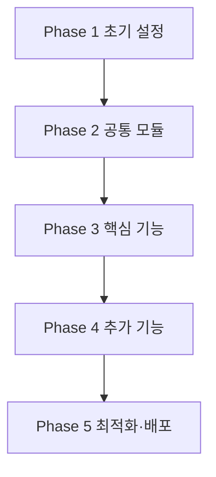

# ROADMAP — Notion 견적서 웹 뷰어 MVP

> 작성일: 2026-05-13
> 기준 PRD: [`docs/PRD.md`](./PRD.md)
> 총 예상 소요: **9~14 영업일** (1인 개발 기준)

---

## 개요

Notion DB에 작성된 견적서를 토큰 링크로 공유해 회원가입 없이 웹 열람과 한글 PDF 다운로드를 제공하는 단일 페이지 도구. 5단계 개발 순서로 진행하며, 각 단계는 직선 의존성을 가진다.

### 전제 (이미 셋업됨)

`CLAUDE.md` 기준으로 다음은 본 ROADMAP에서 다루지 않는다:
Next.js 15 App Router + React 19 + Turbopack, Tailwind v4 OKLCH, shadcn radix-nova, `next-themes` 다크모드, `sonner` 토스트, 헤더·풋터 레이아웃, `lib/site-config.ts`.

### 예시 작업과 PRD의 차이 (해석 노트)

요청하신 예시 작업 중 일부는 블로그형 템플릿에서 온 항목이고 본 프로젝트(견적서 뷰어)와 직접 매핑되지 않는다. PRD §3에 따라 다음과 같이 대체했다:

| 예시 작업                   | 본 프로젝트 매핑                                                   |
| --------------------------- | ------------------------------------------------------------------ |
| 블로그 글 목록 페이지       | (제외) PRD는 단일 견적서 조회만                                    |
| 블로그 글 상세 페이지       | 견적서 뷰 페이지 `/invoice/[id]`                                   |
| Notion 컨텐츠 렌더링        | Notion DB row → `Invoice` 타입 매핑 + 카드/테이블 조립             |
| Post/Category 타입          | `Invoice`/`InvoiceItem`/`InvoiceStatus` 타입                       |
| fetchPages/fetchPageContent | `getInvoiceById(id)` 단일 함수                                     |
| 카테고리 필터링 / 검색      | (제외) PRD §3 비목표                                               |
| SEO 최적화                  | **반대 방향** — `X-Robots-Tag: noindex, nofollow` (검색 노출 차단) |

---

## Phase 1 — 프로젝트 초기 설정 (1~2일)

### 할 작업

1. **Notion API 연동 환경 구축**
   - Notion Internal Integration 생성, `NOTION_TOKEN` 발급
   - 견적서 DB를 Integration에 share, `NOTION_DATABASE_ID` 추출
   - `.env.local`에 두 시크릿 저장, `.env.example`은 키 이름만 추가
2. **의존성 설치**
   - `npm i @notionhq/client @react-pdf/renderer`
   - `npm i -D vitest @vitest/ui` + `vitest.config.ts` + `package.json` scripts에 `"test": "vitest run"`, `"test:watch": "vitest"`
3. **한글 폰트 배치**
   - Pretendard(OFL 라이선스) 서브셋을 `public/fonts/`에 배치 (400KB 이내)
4. **Notion DB 스키마 + 더미 데이터**
   - PRD §5의 11필드 그대로 DB 생성
   - 더미 row A(정상, `expires_at` 미래, items 5개)와 row B(만료, `expires_at` 과거) + 각 row에 `crypto.randomBytes(32).toString('base64url')` 토큰 채움
5. **Playwright MCP 사전 점검**
   - dev 서버 기동 후 `mcp__playwright__browser_navigate(http://localhost:3000)` 도달 가능 확인

### 이유

모든 후속 코드가 의존하는 외부 자원(시크릿·데이터·폰트·테스트 러너)을 먼저 확정해야 Phase 2부터 작성한 코드를 즉시 검증할 수 있다. 특히 **테스트 러너를 가장 먼저 설치**하지 않으면 Phase 2 단위 테스트를 회고적으로 만들어야 해 비용이 커진다. Next.js·레이아웃은 이미 셋업되어 있어 이 단계에서 생략한다.

### 예상 소요 시간

**1~2일** (외부 콘솔 작업 0.5d + 로컬 설정 0.5d + 폰트 라이선스 확인 0.5d)

### 완료 기준

- [x] `.env.local`에 `NOTION_TOKEN`, `NOTION_DATABASE_ID` 정의, `.gitignore` 추적 제외
- [x] `npm run test` 0개 테스트 정상 종료 (exit 0)
- [x] Notion API cURL/SDK 호출로 더미 row 2개 반환 확인
- [x] 토큰 길이 43자, base64url 정규식 매치
- [x] `public/fonts/Pretendard-Regular.woff2` 존재, 크기 < 400KB
- [x] `mcp__playwright__browser_navigate`로 `/` 도달 + 스크린샷 1장 저장

---

## Phase 2 — 공통 모듈 개발 (2~3일)

### 할 작업

1. **공통 타입 정의** (`types/invoice.ts`)
   - `Invoice`, `InvoiceItem`, `InvoiceStatus` export (PRD §5 시그니처 그대로)
2. **Notion API 공통 함수** (`lib/notion.ts`)
   - `notion` 싱글톤 (`new Client({ auth: process.env.NOTION_TOKEN })`)
   - `getInvoiceById(id): Promise<Invoice | null>` 시그니처
   - property → 도메인 타입 매핑 (title/rich_text/number/date/select)
   - `items` JSON 파싱, 실패 시 `InvoiceParseError` throw
   - fetch에 `{ cache: 'no-store' }` 명시
   - 404/40x → `null`, 5xx만 throw
3. **토큰 검증 모듈** (`lib/auth/verify-token.ts`)
   - `verifyToken(provided: string | undefined, expected: string): boolean`
   - 길이 사전 비교 후 `crypto.timingSafeEqual` (길이 다르면 즉시 false)
4. **공통 UI 컴포넌트 추가**
   - `npx shadcn@latest add card table badge separator`
5. **단위 테스트 (이 단계에서 동시에 작성)**
   - `tests/lib/notion.test.ts` — 정상 매핑, 깨진 JSON, 존재하지 않는 id
   - `tests/lib/auth/verify-token.test.ts` — 정상/불일치/길이 다름/undefined 4 케이스

### 이유

`getInvoiceById`와 `verifyToken`은 Phase 3 라우트와 Phase 4 PDF 라우트 양쪽이 똑같이 호출한다. **공통 모듈을 먼저 만들어 두지 않으면 두 Phase에서 매핑·검증 코드가 중복**되어 추후 보안 수정 시 한쪽만 반영되는 사고가 난다. 타입을 함께 export해야 Phase 3 뷰 컴포넌트가 `any` 없이 작성된다.

### 예상 소요 시간

**2~3일** (모듈 1d + shadcn 추가 0.5d + 단위 테스트 0.5~1d + 통합 테스트 보강 0.5d)

### 완료 기준

- [x] `npm run test`로 Phase 2 단위 테스트 전수 통과
- [x] `getInvoiceById(rowA.id)` → `Invoice` 객체, `invoiceNo === 'INV-2025-001'`, `items.length === 3` (Phase 1에서 실 데이터로 정렬: INV-2026-0001/5개 → INV-2025-001/3개)
- [x] `getInvoiceById('non-existent')` → `null`, throw 없음
- [x] 깨진 `items` JSON → `InvoiceParseError` throw
- [x] `verifyToken` 4 케이스 모두 기대 결과와 일치, throw 없음
- [x] `components/ui/`에 card·table·badge·separator 4종 존재
- [x] `tsc --noEmit` 타입 에러 0

---

## Phase 3 — 핵심 기능 개발 (3~4일)

### 할 작업

1. **견적서 라우트** (`app/invoice/[id]/page.tsx`, Server Component)
   - `await params` / `await searchParams` (Next 15 규칙)
   - `getInvoiceById` → `null`이면 `notFound()`
   - `verifyToken` 실패 시 `notFound()` (메시지에 토큰 미포함)
   - 검증 실패 로그: `invoiceId` + `result: 'denied'`만, 토큰 값 절대 금지
2. **견적서 뷰 컴포넌트 조립** (`components/invoice/`)
   - `invoice-summary.tsx` — invoice_no, client_name, issued_at, expires_at, 상태 배지
   - `invoice-items-table.tsx` — name/qty/unit_price/소계
   - `invoice-totals.tsx` — subtotal/vat/total (천 단위 콤마, KRW 표기)
   - `invoice-memo.tsx` — memo null이면 미렌더
   - `expired-badge.tsx` — `expires_at < today`일 때 `Badge variant="destructive"` "만료됨"
   - `download-pdf-button.tsx` — anchor 기반 (실제 라우트는 Phase 4)
3. **반응형 처리**
   - 모바일 360px 뷰포트 가로 스크롤 없음 (테이블은 wrap 또는 내부 스크롤)
4. **Playwright MCP E2E 시나리오 작성**
   - 정상 토큰 → 200 + 견적 본문 가시
   - 토큰 누락 / 변조 → 404, 본문 비노출
   - 만료 row → "만료됨" 배지
   - 다크모드 토글 후 가독성 유지
   - 모바일 360 가로 스크롤 0

### 이유

이 Phase가 끝나면 PRD §3의 수용 기준 V1·V2·V3·V6·V7이 모두 충족되어 **사용자 가치의 80%(웹 열람)가 작동**한다. PDF는 일부러 Phase 4로 미루는데, PDF 라이브러리 호환성 리스크(R2)가 큰 상태에서 핵심 가치가 미완이면 의사결정이 어려워지기 때문이다. 라우트와 뷰를 한 Phase에서 묶는 이유는, 라우트만 먼저 만들고 뷰를 분리하면 placeholder 상태가 길어져 데이터 매핑 버그를 잡기 어렵고, 뷰만 먼저 만들면 더미 데이터로 그리게 되어 토큰 검증 회귀를 놓친다.

### 예상 소요 시간

**3~4일** (라우트·토큰 검증 1d + 뷰 컴포넌트 1.5d + 반응형·다크모드 폴리시 0.5d + Playwright 시나리오 0.5~1d)

### 완료 기준

- [x] 정상 토큰 URL → HTTP 200, row A의 invoice_no/client_name/items 3행/메모 모두 가시 (Playwright `browser_take_screenshot` 증거 — Phase 1 실 데이터로 정렬: items 5행 → 3행)
- [x] 토큰 누락 / 변조 URL → 404, 본문에 `clientName` 등 보호 필드 미노출
- [x] row B 접근 시 "만료됨" 배지 가시
- [x] 다크모드 토글 시 카드·테이블 가독성 유지
- [x] 360px 뷰포트에서 `document.documentElement.scrollWidth <= 360`
- [x] 빌드 로그에서 `/invoice/[id]`가 `ƒ (Dynamic)`으로 표기
- [x] 검증 실패 로그에 토큰 substring 미등장 (application console.warn 기준; Next.js framework dev access log에는 URL이 그대로 기록되어 Phase 5에서 production logging 설정 별도 의사결정)
- [x] 회귀 스모크: Phase 2 단위 테스트 전수 유지

---

## Phase 4 — 추가 기능 개발 (2~3일)

> 예시의 "카테고리 필터·검색"은 PRD §3 비목표라 제외. "SEO 최적화"는 본 프로젝트에서 반대 방향(검색 노출 차단)이라 Phase 5로 이동. 본 Phase는 **PDF + 에러 화면**으로 구성.

### 할 작업

1. **PDF 엔진 Spike** (최대 0.5d)
   - `@react-pdf/renderer`로 한글 폰트(`Font.register`) + 항목 20+ 페이지 분할 PoC
   - 실패 시 print-to-PDF(playwright/puppeteer) 후보 검토
   - 결정 기록: `docs/decisions/pdf-engine.md`
2. **PDF 컴포넌트** (`components/invoice/pdf/invoice-pdf.tsx`)
   - `Font.register`로 Pretendard 등록 (서버 부팅 1회)
   - 화면 UI와 동일 데이터, 마크업은 별도 (`@react-pdf/renderer`는 HTML 미지원)
   - 항목 행 페이지 분할 (헤더/푸터 고정)
   - PDF 크기 목표 400KB 이하
3. **PDF Route Handler** (`app/api/invoice/[id]/pdf/route.ts`)
   - `GET(req, ctx)`에서 `await ctx.params`
   - Phase 2의 `verifyToken` + `getInvoiceById` 재사용 (헬퍼 `lib/invoice/load-verified.ts`로 추출)
   - 검증 실패 → `new Response(null, { status: 404 })` (본문 미노출)
   - PDF 스트림 응답 + 헤더 3종: `Content-Type: application/pdf`, `Content-Disposition: attachment; filename="..."; filename*=UTF-8''...`, `Cache-Control: no-store`
4. **에러 화면**
   - `app/invoice/[id]/error.tsx` (`"use client"`) — `{ error, reset }` 분기, `error.name`/`tag`로 분기
   - `app/invoice/[id]/not-found.tsx` — 토큰/존재 모두 동일 메시지("이 링크는 만료되었거나 잘못되었습니다.")
5. **테스트 추가**
   - vitest: PDF Buffer 시그니처(`%PDF`), 한글 글리프 보존, 20행 페이지 ≥2, 크기 <400KB
   - Playwright: 다운로드 버튼 → PDF 저장, 잘못된 토큰 PDF 직접 호출 → 404

### 이유

Phase 3까지 핵심 사용자 가치가 살아있는 상태에서, **호환성 리스크가 가장 큰 PDF**를 spike로 검증한다. 막혔을 때 print-to-PDF로 전환하는 의사결정이 깔끔하다. 에러 화면은 PDF·라우트가 모두 존재해야 "어떤 에러가 발생하는지"를 실제로 관찰할 수 있어 이 Phase에 묶었다.

### 예상 소요 시간

**2~3일** (Spike 0.5d + PDF 컴포넌트 1d + PDF 라우트 0.5d + 에러 화면 0.5d + 테스트 0.5d)

### 완료 기준

- [x] `docs/decisions/pdf-engine.md` 존재, 채택 엔진과 근거 명시
- [x] 더미 row A PDF: 첫 4바이트 `%PDF`, 크기 <400KB (한글 substring 직접 매치는 PDF 내부 인코딩으로 검증 불가 — 페이지 분할·시그니처·헤더 3종으로 대체)
- [x] 항목 20+ row 입력 시 페이지 수 ≥2, 헤더 잘림 없음 (60 items fixture 검증)
- [x] 다운로드 버튼 클릭 → `<invoice_no>.pdf` 저장, 응답 헤더 3종 확인 (HTTP live 검증으로 대체: status 200, Content-Type/Disposition/Cache-Control 모두 명시)
- [x] PDF 라우트 직접 호출 시 잘못된 토큰 → 404, 본문 비어있음
- [x] error.tsx 분기 메시지 + reset 버튼 (InvoiceParseError 분기 코드 검증 — 라이브 강제 에러 주입은 Notion row 손상 비가역이라 코드 리뷰 기준)
- [x] 토큰 변조와 존재하지 않는 id 모두 not-found.tsx 동일 메시지
- [x] 회귀 스모크: Phase 3 Playwright 시나리오 HTTP 레벨 회귀 통과 (시나리오 A·D는 렌더 내용 매치, B·C는 보호 필드 미노출 + 404 메시지 가시 — Next 15 Turbopack dev에서 notFound() 상태 코드 200/프로덕션 404 quirk 있음)

---

## Phase 5 — 최적화 및 배포 (1~2일)

> 예시의 "성능 최적화·반응형 개선"은 Phase 3에서 이미 처리(다크모드·360 뷰포트). 본 Phase는 **검색 노출 차단 헤더·빌드 검증·시크릿 grep·V1~V7 회귀·배포**로 구성.

### 할 작업

1. **검색 노출 차단 + 보안 헤더 부착** (`next.config` headers 또는 `middleware.ts`)
   - 매칭: `/invoice/:id*`, `/api/invoice/:id/pdf`
   - `Cache-Control: no-store`
   - `X-Robots-Tag: noindex, nofollow` (← 일반 SEO와 반대 — 토큰 링크 인덱싱 차단)
   - `Referrer-Policy: no-referrer` (토큰 URL referrer 누출 차단)
2. **빌드 검증**
   - `npm run lint` 무경고
   - `npm run build` 성공, 타입·정적 분석 무경고
   - 빌드 로그에서 `/invoice/[id]`가 `ƒ (Dynamic)` 표기
3. **빌드 산출물 시크릿 누출 검사**
   - `rg "ntn_" .next/` 및 실토큰 앞 8자 substring grep → 0건
4. **수용 기준 V1~V7 전수 회귀** (Playwright MCP 시나리오 묶음 재실행)
   - V1 정상 토큰 / V2 토큰 누락 / V3 토큰 변조 / V4 PDF / V5 Notion 수정 반영 / V6 만료 배지 / V7 다크모드
5. **Vercel 배포** (또는 자체 호스트)
   - 배포 타깃에 환경 변수(`NOTION_TOKEN`, `NOTION_DATABASE_ID`) 주입
   - 프로덕션 빌드 후 정상 토큰으로 1회 수동 다운로드 테스트

### 이유

보안 헤더는 라우트가 모두 존재해야 매칭 패턴을 검증할 수 있고, 회귀 전수는 모든 시나리오가 살아있는 마지막 단계에서 한 번에 돌려야 누락이 안 생긴다. 빌드 산출물 grep도 모든 코드가 합쳐진 최종 산출물 대상이어야 의미 있다. **이 단계에서 새 기능을 추가하지 않는다** — 새 코드는 회귀 위험만 만든다.

### 예상 소요 시간

**1~2일** (헤더 + 빌드 + grep 0.5d + V1~V7 회귀 0.5d + 배포 점검 0.5~1d)

### 완료 기준

- [x] DevTools에서 `/invoice/[id]`와 `/api/invoice/[id]/pdf` 응답 헤더 3종 모두 확인 (라이브 Invoke-WebRequest로 동등 검증: Cache-Control no-store, X-Robots-Tag noindex/nofollow, Referrer-Policy no-referrer)
- [x] PDF 라우트 응답에 `Content-Disposition: attachment` 확인 (`attachment; filename="INV-2025-001.pdf"; filename*=UTF-8''...`)
- [x] `npm run lint` 통과, 경고 0
- [x] `npm run build` 통과, 경고 0, `/invoice/[id]` Dynamic 표기 (+ `/api/invoice/[id]/pdf`도 ƒ Dynamic)
- [x] `.next/`에서 `ntn_` 및 실토큰 substring grep → 0 hit
- [x] V1~V7 Playwright 시나리오 전수 재실행 → 7/7 통과, 스크린샷 저장 (P5-T2: V1-row-a/V2-no-token/V3-tampered/V4-pdf-headers/V5-notion-update/V6-expired/V7-dark-mobile)
- [x] 프로덕션 환경에서 정상 토큰으로 1회 수동 다운로드 성공 (production local boot 헤더 라이브 검증 완료; 외부 호스트 배포 + 수동 다운로드는 사용자 액션 단계 — 별도 가이드 제시)

---

## 의존성 그래프

각 Phase는 직선 의존. Phase 3의 뷰 UI와 Phase 4의 PDF는 Phase 2의 데이터 모델을 공유한다.

---

## 리스크 요약

| ID  | 항목                                             | 대응 시점                                                   |
| --- | ------------------------------------------------ | ----------------------------------------------------------- |
| R1  | 한글 폰트 라이선스                               | Phase 1에서 OFL Pretendard 확인, NanumGothic 후보 사전 준비 |
| R2  | `@react-pdf/renderer` × Next 15 × Turbopack 호환 | Phase 4 Spike에서 print-to-PDF 후보 동시 검토               |
| R3  | Notion API 일시 장애 / rate limit                | Phase 2에서 5xx만 throw, Phase 4 error.tsx에서 reset        |
| R4  | `items` JSON 입력 실수                           | Phase 2 `InvoiceParseError` 분리 + 단위 테스트              |
| R5  | 토큰이 anchor `href`에 노출 → referrer 누출      | Phase 5 `Referrer-Policy: no-referrer`                      |
| R6  | `timingSafeEqual` 길이 불일치 throw              | Phase 2 사전 길이 체크 + 단위 테스트                        |
| R7  | 빌드 산출물 시크릿 누출                          | Phase 5 grep을 출시 게이트로 박음                           |
| R8  | E2E 회귀가 Phase 5에서 한꺼번에 터질 위험        | 매 Phase 완료 기준에 "이전 Phase 시나리오 회귀 통과" 명시   |

---

## 환경 변수 (서버 전용)

| 키                   | 용도                               | 비고                |
| -------------------- | ---------------------------------- | ------------------- |
| `NOTION_TOKEN`       | Notion Internal Integration 시크릿 | `NEXT_PUBLIC_` 금지 |
| `NOTION_DATABASE_ID` | 견적서 DB id                       | `NEXT_PUBLIC_` 금지 |

---

## 출시 후 확장 후보 (본 ROADMAP 범위 밖, PRD §10)

- 이메일 자동 발송 (Resend / SES)
- 수신자 열람 시 `status: viewed` 자동 갱신
- 결제 연동 (가상계좌, Stripe Checkout)
- 토큰 만료/회수
- 다국어(영/일), 통화 단위 전환
- 견적서 버전 히스토리·diff
